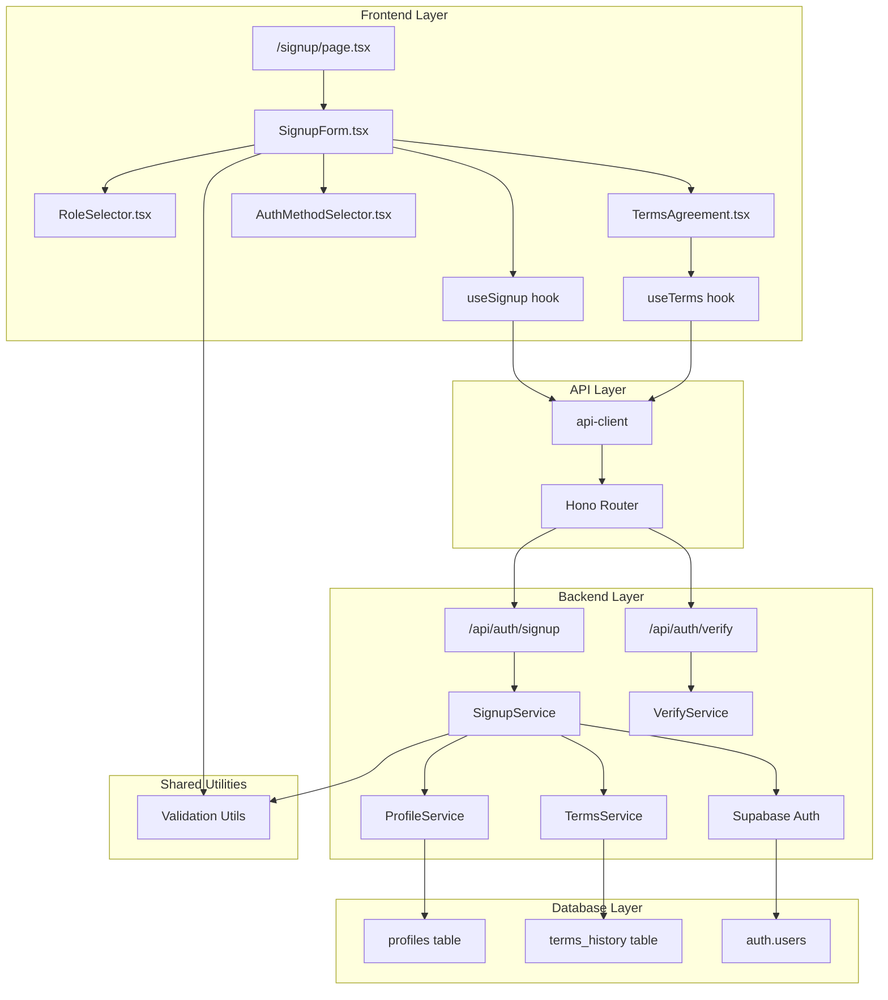

# 회원가입 & 역할선택 모듈 설계서

## 개요

### 핵심 모듈 목록

#### 1. Backend Modules
- **`src/features/auth/backend/signup`**: 회원가입 핵심 비즈니스 로직
  - `route.ts`: Hono 라우터 정의 (POST /api/auth/signup)
  - `service.ts`: Supabase Auth 및 프로필 생성 로직
  - `schema.ts`: 요청/응답 Zod 스키마 정의
  - `error.ts`: 회원가입 관련 에러 코드 정의

- **`src/features/auth/backend/terms`**: 약관 관리 모듈
  - `service.ts`: 약관 동의 이력 저장 로직
  - `schema.ts`: 약관 데이터 스키마

- **`src/features/auth/backend/verify`**: 이메일 인증 모듈
  - `route.ts`: GET /api/auth/verify 라우터
  - `service.ts`: 인증 토큰 검증 로직

#### 2. Frontend Modules
- **`src/features/auth/components/signup`**: 회원가입 UI 컴포넌트
  - `SignupForm.tsx`: 기본 정보 입력 폼
  - `RoleSelector.tsx`: 역할 선택 컴포넌트
  - `TermsAgreement.tsx`: 약관 동의 체크박스 그룹
  - `AuthMethodSelector.tsx`: 인증 방식 선택 (이메일/외부)

- **`src/features/auth/hooks`**: 회원가입 관련 훅
  - `useSignup.ts`: 회원가입 mutation 훅
  - `useEmailVerify.ts`: 이메일 인증 훅
  - `useTerms.ts`: 약관 조회 훅

#### 3. Shared Modules
- **`src/lib/validation`**: 공통 검증 유틸리티
  - `phone.ts`: 휴대폰번호 검증
  - `birthdate.ts`: 생년월일 검증
  - `email.ts`: 이메일 형식 검증

- **`src/lib/supabase/auth`**: Supabase Auth 헬퍼
  - `signup.ts`: 회원가입 래퍼 함수
  - `oauth.ts`: 외부 인증 제공자 설정

- **`src/constants/auth`**: 인증 관련 상수
  - `roles.ts`: 사용자 역할 enum
  - `providers.ts`: 외부 인증 제공자 목록

#### 4. Database Modules
- **`supabase/migrations`**: 데이터베이스 마이그레이션
  - `0002_terms_history.sql`: 약관 동의 이력 테이블

## Diagram



## Implementation Plan

### Phase 1: Database Layer
#### 1. 약관 이력 테이블 마이그레이션
```sql
-- supabase/migrations/0002_terms_history.sql
CREATE TABLE IF NOT EXISTS terms_history (
  id UUID PRIMARY KEY DEFAULT gen_random_uuid(),
  user_id UUID NOT NULL REFERENCES profiles(id) ON DELETE CASCADE,
  terms_type VARCHAR(50) NOT NULL,
  terms_version VARCHAR(20) NOT NULL,
  agreed_at TIMESTAMP WITH TIME ZONE NOT NULL,
  ip_address INET,
  user_agent TEXT,
  created_at TIMESTAMP WITH TIME ZONE DEFAULT NOW()
);

CREATE INDEX idx_terms_history_user_id ON terms_history(user_id);
CREATE INDEX idx_terms_history_agreed_at ON terms_history(agreed_at);
ALTER TABLE terms_history DISABLE ROW LEVEL SECURITY;
```

### Phase 2: Backend Implementation

#### 1. Schema 정의 (src/features/auth/backend/signup/schema.ts)
```typescript
import { z } from 'zod';

export const signupRequestSchema = z.object({
  // 기본 정보
  email: z.string().email(),
  password: z.string().min(8).optional(), // 외부 인증시 선택
  name: z.string().min(1).max(100),
  birthDate: z.string().refine(/* 생년월일 검증 */),
  phone: z.string().refine(/* 휴대폰번호 검증 */),

  // 역할
  role: z.enum(['advertiser', 'influencer']),

  // 약관
  termsAgreed: z.array(z.object({
    type: z.string(),
    version: z.string(),
  })),

  // 인증 방식
  authMethod: z.enum(['email', 'google', 'kakao']),

  // 메타데이터
  ipAddress: z.string().optional(),
  userAgent: z.string().optional(),
});

export const signupResponseSchema = z.object({
  success: z.boolean(),
  userId: z.string().uuid().optional(),
  requiresEmailVerification: z.boolean(),
  redirectUrl: z.string().optional(),
  error: z.string().optional(),
});
```

**Unit Tests:**
- 이메일 형식 검증
- 비밀번호 강도 검증
- 생년월일 형식 및 유효성 검증
- 휴대폰번호 형식 검증
- 역할 값 검증

#### 2. Service 구현 (src/features/auth/backend/signup/service.ts)
```typescript
export class SignupService {
  async createUser(data: SignupRequest): Promise<SignupResponse> {
    // 1. 이메일 중복 확인
    // 2. Supabase Auth 계정 생성
    // 3. profiles 테이블에 기본 정보 저장
    // 4. terms_history에 약관 동의 이력 저장
    // 5. 이메일 인증 메일 발송 (선택적)
    // 6. 응답 반환
  }

  async checkEmailDuplicate(email: string): Promise<boolean> {
    // 이메일 중복 확인 로직
  }
}
```

**Unit Tests:**
- 정상 회원가입 플로우
- 이메일 중복 처리
- Supabase Auth 에러 처리
- 트랜잭션 롤백 테스트
- 약관 이력 저장 검증

#### 3. Route 정의 (src/features/auth/backend/signup/route.ts)
```typescript
export function registerSignupRoutes(app: Hono<AppEnv>) {
  app.post('/auth/signup', async (c) => {
    // 1. 요청 검증
    // 2. 레이트 리밋 체크
    // 3. Service 호출
    // 4. 응답 반환
  });

  app.get('/auth/verify', async (c) => {
    // 이메일 인증 처리
  });

  app.post('/auth/check-email', async (c) => {
    // 이메일 중복 확인 (실시간)
  });
}
```

### Phase 3: Frontend Implementation

#### 1. 회원가입 폼 컴포넌트 (src/features/auth/components/signup/SignupForm.tsx)
```typescript
export function SignupForm() {
  // react-hook-form 사용
  // 실시간 유효성 검사
  // 단계별 폼 진행 (기본정보 → 역할선택 → 약관동의 → 인증방식)
}
```

**QA Sheet:**
- [x] 이메일 실시간 중복 체크 동작
- [x] 비밀번호 강도 표시기 동작
- [x] 비밀번호 확인 일치 검증
- [x] 휴대폰번호 자동 포맷팅
- [x] 생년월일 달력 UI 동작
- [x] 역할 선택 라디오 버튼
- [x] 약관 전체 동의 체크박스
- [x] 개별 약관 동의 체크박스
- [ ] 외부 인증 버튼 동작 (구현 필요)
- [x] 폼 제출 시 로딩 상태
- [x] 에러 메시지 표시
- [x] 성공 시 리다이렉트

#### 2. React Query 훅 (src/features/auth/hooks/useSignup.ts)
```typescript
export function useSignup() {
  return useMutation({
    mutationFn: async (data: SignupFormData) => {
      return await apiClient.post('/api/auth/signup', data);
    },
    onSuccess: (data) => {
      // 역할에 따른 리다이렉트 처리
    },
  });
}
```

#### 3. 역할 선택 컴포넌트 (src/features/auth/components/signup/RoleSelector.tsx)
```typescript
export function RoleSelector({ value, onChange }: RoleSelectorProps) {
  // 광고주/인플루언서 선택 UI
  // 각 역할에 대한 설명 포함
}
```

**QA Sheet:**
- [x] 역할 선택 시 시각적 피드백
- [x] 역할 설명 텍스트 표시
- [x] 선택된 역할 하이라이트

#### 4. 약관 동의 컴포넌트 (src/features/auth/components/signup/TermsAgreement.tsx)
```typescript
export function TermsAgreement({ onAgree }: TermsAgreementProps) {
  // 전체 동의 체크박스
  // 개별 약관 체크박스 목록
  // 약관 내용 보기 링크
}
```

**QA Sheet:**
- [x] 전체 동의 시 개별 항목 자동 체크
- [x] 개별 항목 해제 시 전체 동의 해제
- [x] 필수 약관 검증
- [x] 약관 내용 모달/페이지 연결

### Phase 4: Integration & Testing

#### 1. E2E 테스트 시나리오
1. **정상 플로우**
   - 모든 필드 올바르게 입력
   - 이메일 인증 완료
   - 역할별 페이지 리다이렉트 확인

2. **에러 케이스**
   - 중복 이메일 에러 처리
   - 유효하지 않은 입력 처리
   - 네트워크 에러 처리
   - 인증 실패 처리

3. **외부 인증**
   - Google OAuth 플로우
   - Kakao OAuth 플로우

#### 2. 성능 최적화
- 이메일 중복 체크 디바운싱
- 폼 단계별 레이지 로딩
- 약관 내용 캐싱

### Phase 5: Post-Launch Monitoring

#### 1. 로깅 및 모니터링
- 회원가입 성공/실패율 추적
- 에러 발생 패턴 분석
- 인증 방식별 사용률 통계

#### 2. A/B 테스팅 준비
- 폼 단계 순서 변경 테스트
- 역할 선택 UI 개선 테스트
- 약관 동의 UX 개선 테스트

## 기술 스택
- **Frontend**: Next.js, React Hook Form, Tanstack Query, Zod
- **Backend**: Hono, Supabase Auth, PostgreSQL
- **Validation**: Zod (Frontend & Backend 공유)
- **Styling**: Tailwind CSS, shadcn/ui
- **Testing**: Jest (Unit), Playwright (E2E)

## 보안 고려사항
1. **레이트 리밋**: 봇/스팸 방지를 위한 IP 기반 제한
2. **CSRF 보호**: Supabase Auth 내장 보호
3. **SQL Injection**: Parameterized queries 사용
4. **비밀번호**: Supabase Auth에서 bcrypt 해싱 (Auth 레이어)
5. **개인정보**: 민감 정보 로깅 제외

## 확장 가능성
1. **소셜 로그인 추가**: Naver, Apple 등
2. **2단계 인증**: SMS, TOTP
3. **프로필 사진 업로드**: 회원가입 시 선택적
4. **추천인 시스템**: 추천 코드 입력
5. **기업 회원가입**: 별도 플로우 구현