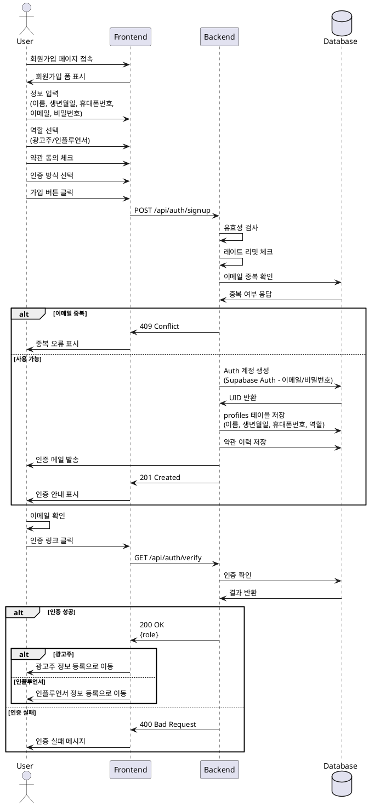

# 유스케이스: 회원가입 & 역할선택

## Primary Actor
신규 사용자 (광고주 또는 인플루언서)

## Precondition
- 사용자가 서비스에 가입하지 않은 상태
- 이메일 주소가 유효하고 접근 가능

## Trigger
사용자가 회원가입 버튼을 클릭

## Main Scenario

1. 사용자가 회원가입 페이지에 접속
2. 시스템이 회원가입 폼을 표시
3. 사용자가 기본 정보 입력
   - 이름
   - 생년월일
   - 휴대폰번호
   - 이메일
   - 비밀번호 (이메일 인증 선택 시)
4. 사용자가 역할 선택 (광고주/인플루언서)
5. 사용자가 약관 동의 체크
6. 사용자가 인증 방식 선택 (이메일/외부)
7. 사용자가 가입 버튼 클릭
8. 시스템이 입력 정보 유효성 검사
9. 시스템이 Supabase Auth에 계정 생성 (이메일/비밀번호 또는 외부 인증)
10. 시스템이 프로필 최소 레코드 생성 (이름, 생년월일, 휴대폰번호, 역할)
11. 시스템이 약관 이력 저장
12. 시스템이 인증 메일 발송
13. 사용자가 이메일 인증 완료
14. 시스템이 역할별 정보 등록 페이지로 리다이렉트

## Edge Cases

### E1: 이미 등록된 이메일
- 시스템이 중복 이메일 오류 메시지 표시
- 로그인 페이지 링크 제공

### E2: 이메일 인증 실패
- 인증 코드 재발송 옵션 제공

### E3: 유효하지 않은 입력
- 실시간 입력 검증 피드백
- 구체적인 오류 메시지 표시

### E4: 봇/스팸 감지
- 레이트 리밋 적용

## Business Rules

1. **필수 정보 규칙**
   - 이름, 생년월일, 휴대폰번호, 이메일 필수 입력
   - 이메일은 유효한 형식이어야 함
   - 비밀번호는 이메일 인증 방식 선택 시 필수
   - 역할 필수 선택

2. **약관 동의**
   - 서비스 이용약관 필수 동의
   - 개인정보 처리방침 필수 동의

3. **인증 규칙**
   - 이메일 인증 완료 후 서비스 이용 가능
   - 외부 인증 (Google, Kakao 등) 선택 가능
   - Supabase Auth가 인증 정보 관리 (비밀번호는 Auth 레이어에서만 관리)

4. **역할 관련**
   - 가입 시 역할 필수 선택
   - 역할에 따라 추가 정보 등록 페이지 분기

---

## Sequence Diagram

