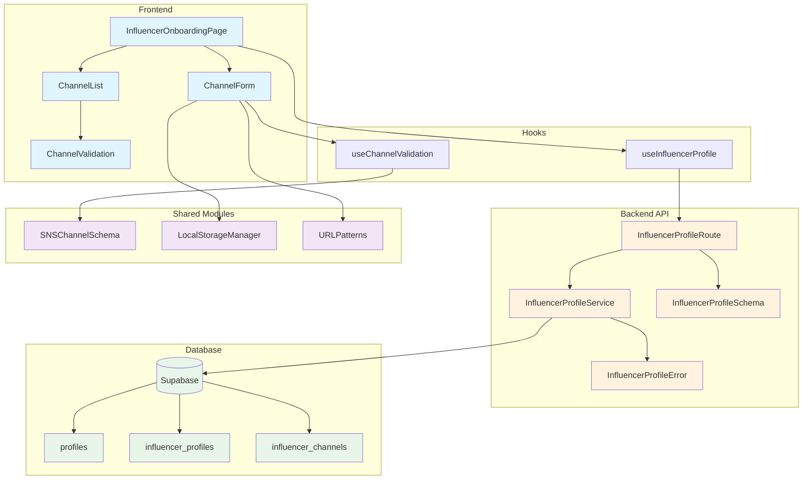

# 인플루언서 정보 등록 모듈 설계

## 개요

인플루언서가 회원가입 후 SNS 채널 정보를 등록하는 기능을 구현하기 위한 모듈 설계입니다.

### 모듈 목록

| 모듈명 | 위치 | 설명 |
|--------|------|------|
| **Backend** | | |
| InfluencerProfileRoute | `src/features/influencer/backend/route.ts` | 인플루언서 프로필 API 라우트 정의 |
| InfluencerProfileService | `src/features/influencer/backend/service.ts` | 프로필 비즈니스 로직 처리 |
| InfluencerProfileSchema | `src/features/influencer/backend/schema.ts` | 요청/응답 스키마 정의 |
| InfluencerProfileError | `src/features/influencer/backend/error.ts` | 에러 코드 정의 |
| **Frontend** | | |
| InfluencerOnboardingPage | `src/app/onboarding/influencer/page.tsx` | 온보딩 페이지 컨테이너 |
| ChannelForm | `src/features/influencer/components/ChannelForm.tsx` | SNS 채널 입력 폼 컴포넌트 |
| ChannelList | `src/features/influencer/components/ChannelList.tsx` | 등록된 채널 목록 컴포넌트 |
| ChannelValidation | `src/features/influencer/components/ChannelValidation.tsx` | 채널 검증 상태 표시 |
| **Hooks** | | |
| useInfluencerProfile | `src/features/influencer/hooks/useInfluencerProfile.ts` | 프로필 조회/저장 훅 |
| useChannelValidation | `src/features/influencer/hooks/useChannelValidation.ts` | 채널 URL 유효성 검사 훅 |
| **Shared** | | |
| SNSChannelSchema | `src/lib/validation/sns-channel.ts` | SNS 플랫폼별 URL 패턴 검증 |
| LocalStorageManager | `src/lib/storage/local-storage.ts` | 임시저장 기능 |
| URLPatterns | `src/constants/sns-platforms.ts` | SNS 플랫폼 URL 패턴 상수 |

## Diagram



## Implementation Plan

### 1. Backend Implementation

#### 1.1 Schema Definition (`src/features/influencer/backend/schema.ts`)
```typescript
// SNS 채널 스키마
- channelSchema: 채널 유형, URL, 채널명, 팔로워수
- createProfileRequestSchema: 채널 배열, 사용자 ID
- updateProfileRequestSchema: 채널 추가/수정
- profileResponseSchema: 프로필 정보 + 채널 목록
```

**Unit Tests:**
- 유효한 URL 형식 검증
- 팔로워수 음수 불가 검증
- 필수 필드 검증

#### 1.2 Service Layer (`src/features/influencer/backend/service.ts`)
```typescript
// 비즈니스 로직
- getInfluencerProfile(): 프로필 및 채널 조회
- createOrUpdateProfile(): 프로필 생성/업데이트
- addChannels(): 채널 추가
- updateChannelVerification(): 채널 검증 상태 업데이트
- validateChannelDuplication(): 중복 채널 체크
```

**Unit Tests:**
- 프로필 조회 성공/실패 케이스
- 채널 중복 검증 로직
- 채널 최대 개수(10개) 제한
- 트랜잭션 롤백 처리

#### 1.3 Route Handler (`src/features/influencer/backend/route.ts`)
```typescript
// API 엔드포인트
- GET /api/influencer/profile: 프로필 조회
- POST /api/influencer/profile: 프로필 생성/업데이트
- POST /api/influencer/channels: 채널 추가
- DELETE /api/influencer/channels/:id: 채널 삭제
```

#### 1.4 Error Handling (`src/features/influencer/backend/error.ts`)
```typescript
// 에러 코드 정의
- PROFILE_NOT_FOUND: 프로필 없음
- CHANNEL_DUPLICATE: 중복 채널
- MAX_CHANNELS_EXCEEDED: 최대 채널 수 초과
- INVALID_URL_FORMAT: 잘못된 URL 형식
- CHANNEL_VERIFICATION_FAILED: 채널 검증 실패
```

### 2. Frontend Implementation

#### 2.1 Page Component (`src/app/onboarding/influencer/page.tsx`)
```typescript
// 메인 페이지 컨테이너
- 인증 상태 체크
- 프로필 데이터 로딩
- 채널 추가/삭제 로직
- 저장 처리
- 완료 후 리다이렉트
```

**QA Sheet:**
- [ ] 비로그인 시 로그인 페이지로 리다이렉트
- [ ] 이미 프로필 있는 경우 기존 데이터 표시
- [ ] 저장 성공 시 홈으로 이동
- [ ] 에러 발생 시 토스트 메시지

#### 2.2 ChannelForm Component (`src/features/influencer/components/ChannelForm.tsx`)
```typescript
// 채널 입력 폼
- 채널 유형 선택 (드롭다운)
- URL 입력 (실시간 검증)
- 채널명 입력
- 팔로워수 입력 (숫자만)
- 추가 버튼
```

**QA Sheet:**
- [ ] URL 패턴 실시간 검증
- [ ] 팔로워수 숫자 포맷팅 (천단위 콤마)
- [ ] 필수 필드 검증
- [ ] 중복 URL 입력 방지

#### 2.3 ChannelList Component (`src/features/influencer/components/ChannelList.tsx`)
```typescript
// 채널 목록 표시
- 채널별 카드 UI
- 검증 상태 표시
- 삭제 버튼
- 편집 모드
```

**QA Sheet:**
- [ ] 채널 최대 10개 제한 표시
- [ ] 삭제 확인 다이얼로그
- [ ] 검증 상태별 아이콘/색상
- [ ] 빈 상태 메시지

### 3. Shared Modules

#### 3.1 SNS Channel Validation (`src/lib/validation/sns-channel.ts`)
```typescript
// URL 패턴 검증
- naverBlogPattern: blog.naver.com/{id}
- youtubePattern: youtube.com/@{handle} or /channel/{id}
- instagramPattern: instagram.com/{username}
- threadsPattern: threads.net/@{username}
```

**Unit Tests:**
- 각 플랫폼별 유효 URL 테스트
- 잘못된 URL 형식 거부
- URL 정규화 (trailing slash 등)

#### 3.2 Local Storage Manager (`src/lib/storage/local-storage.ts`)
```typescript
// 임시저장 기능
- saveFormData(): 폼 데이터 저장
- loadFormData(): 저장된 데이터 로드
- clearFormData(): 데이터 삭제
- 만료 시간 관리
```

### 4. Database Migration

#### 4.1 Migration File (`supabase/migrations/0002_influencer_onboarding.sql`)
```sql
-- 이미 존재하는 테이블은 0001_initial_schema.sql에 정의되어 있음
-- 추가 인덱스나 제약조건만 필요시 추가

-- 채널 URL 인덱스 (빠른 중복 체크)
CREATE INDEX IF NOT EXISTS idx_influencer_channels_url
ON influencer_channels(channel_url);

-- 채널 검증 상태 인덱스 (검증 작업 조회)
CREATE INDEX IF NOT EXISTS idx_influencer_channels_verification
ON influencer_channels(verification_status)
WHERE verification_status = 'pending';
```

### 5. Integration Points

#### 5.1 Authentication Integration
- `useCurrentUser` 훅 사용하여 인증 상태 확인
- 역할이 'influencer'인지 검증
- 세션 만료 처리

#### 5.2 React Query Integration
```typescript
// 캐싱 전략
- 프로필 조회: 5분 캐시
- 채널 검증: 폴링 (5초 간격)
- 저장 후 캐시 무효화
```

#### 5.3 Form Validation Integration
- `react-hook-form` 사용
- `zod` 스키마 연동
- 실시간 유효성 검사

### 6. Testing Strategy

#### Backend Tests
- Service 레이어 단위 테스트
- Route 핸들러 통합 테스트
- Supabase 모킹

#### Frontend Tests
- 컴포넌트 렌더링 테스트
- 폼 입력 시뮬레이션
- API 호출 모킹

### 7. Performance Considerations

- 채널 검증은 비동기 백그라운드 처리
- 임시저장은 디바운싱 적용 (500ms)
- 이미지 레이지 로딩 (향후 채널 썸네일 추가 시)
- React Query로 불필요한 재요청 방지

### 8. Security Considerations

- SQL 인젝션 방지 (파라미터화된 쿼리)
- XSS 방지 (입력값 이스케이프)
- CSRF 토큰 검증
- Rate limiting (채널 추가 API)

### 9. Future Enhancements

- OAuth 연동으로 자동 채널 정보 가져오기
- 채널 통계 실시간 업데이트
- 포트폴리오 미리보기
- 채널별 컨텐츠 샘플 업로드