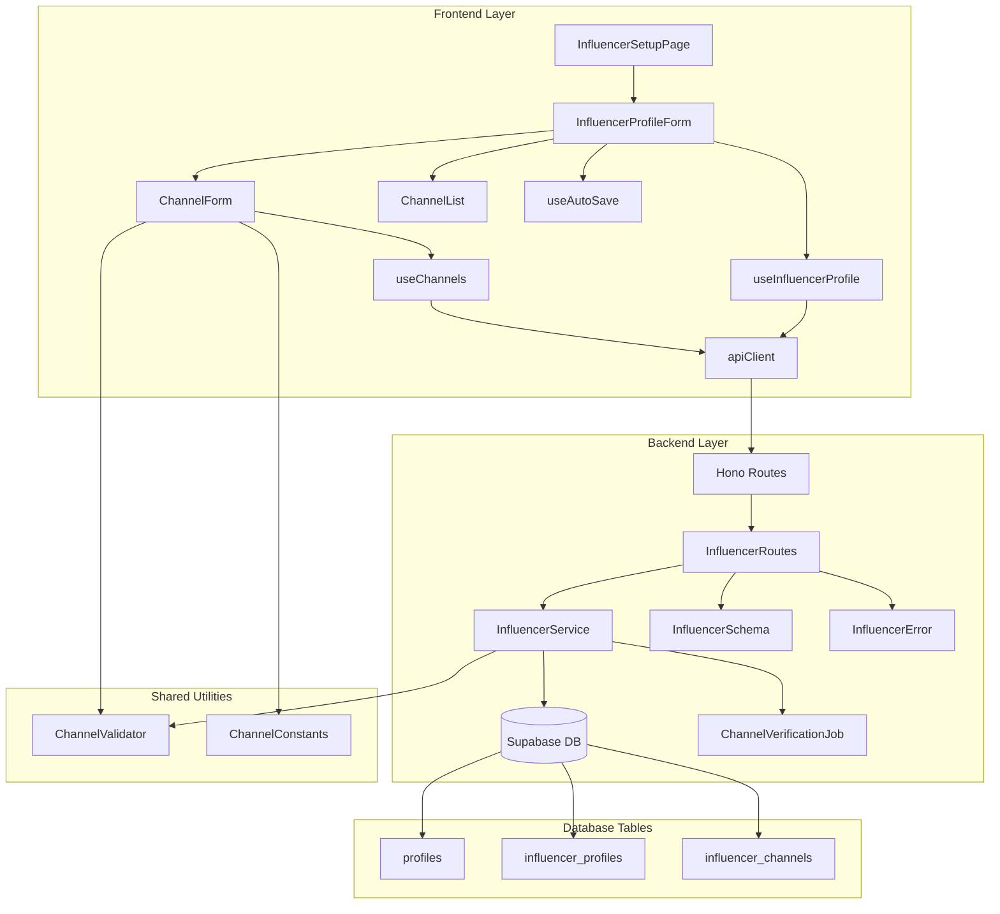

# 인플루언서 정보 등록 기능 설계

## 개요

### 모듈 구성

| 모듈명 | 위치 | 설명 |
|--------|------|------|
| **Backend Layer** | | |
| InfluencerRoutes | `src/features/influencer/backend/route.ts` | 인플루언서 API 엔드포인트 정의 (프로필 조회, 채널 등록/수정/삭제) |
| InfluencerService | `src/features/influencer/backend/service.ts` | 인플루언서 비즈니스 로직 및 Supabase 연동 |
| InfluencerSchema | `src/features/influencer/backend/schema.ts` | 요청/응답 Zod 스키마 정의 |
| InfluencerError | `src/features/influencer/backend/error.ts` | 인플루언서 도메인 에러 코드 정의 |
| **Frontend Layer** | | |
| InfluencerDTO | `src/features/influencer/lib/dto.ts` | Backend 스키마 재노출 |
| InfluencerProfileForm | `src/features/influencer/components/InfluencerProfileForm.tsx` | 인플루언서 정보 입력 메인 폼 |
| ChannelForm | `src/features/influencer/components/ChannelForm.tsx` | SNS 채널 입력 폼 컴포넌트 |
| ChannelList | `src/features/influencer/components/ChannelList.tsx` | 등록된 채널 목록 표시 |
| useInfluencerProfile | `src/features/influencer/hooks/useInfluencerProfile.ts` | 프로필 CRUD React Query 훅 |
| useChannels | `src/features/influencer/hooks/useChannels.ts` | 채널 CRUD React Query 훅 |
| useAutoSave | `src/features/influencer/hooks/useAutoSave.ts` | 임시저장 기능 훅 |
| **Shared Utilities** | | |
| ChannelValidator | `src/lib/validation/channel.ts` | SNS 플랫폼별 URL 패턴 검증 유틸리티 |
| ChannelConstants | `src/features/influencer/constants/channels.ts` | 채널 타입, URL 패턴 상수 |
| **Pages** | | |
| InfluencerSetupPage | `src/app/(protected)/influencer/setup/page.tsx` | 인플루언서 정보 등록 페이지 |
| **Background Jobs** | | |
| ChannelVerificationJob | `src/features/influencer/backend/jobs/verify-channel.ts` | 비동기 채널 검증 작업 |

## Diagram



## Implementation Plan

### 1. Backend Layer

#### 1.1 Schema Definition (`src/features/influencer/backend/schema.ts`)
- **CreateInfluencerChannelSchema**: 채널 생성 요청 스키마
  - `channel_type`: enum (naver, youtube, instagram, threads)
  - `channel_name`: 최대 100자
  - `channel_url`: URL 형식 검증
  - `follower_count`: 0 이상 정수
- **UpdateInfluencerChannelSchema**: 채널 수정 요청 스키마
- **InfluencerProfileResponseSchema**: 프로필 + 채널 목록 응답
- **ChannelVerificationResultSchema**: 채널 검증 결과

#### 1.2 Service Layer (`src/features/influencer/backend/service.ts`)
- `getInfluencerProfile(userId)`: 인플루언서 프로필 및 채널 목록 조회
- `createInfluencerChannel(data)`: 채널 추가 (최대 10개 제한)
- `updateInfluencerChannel(channelId, data)`: 채널 정보 수정
- `deleteInfluencerChannel(channelId)`: 채널 삭제
- `queueChannelVerification(channelId)`: 비동기 검증 큐 등록

**Unit Tests:**
- 채널 중복 등록 방지 테스트
- 최대 10개 채널 제한 테스트
- URL 형식 검증 테스트

#### 1.3 Route Handler (`src/features/influencer/backend/route.ts`)
- `GET /api/influencer/profile/:userId`: 프로필 조회
- `POST /api/influencer/channels`: 채널 추가
- `PUT /api/influencer/channels/:channelId`: 채널 수정
- `DELETE /api/influencer/channels/:channelId`: 채널 삭제
- `POST /api/influencer/profile`: 프로필 일괄 저장

#### 1.4 Error Codes (`src/features/influencer/backend/error.ts`)
```typescript
export const influencerErrorCodes = {
  channelLimitExceeded: 'CHANNEL_LIMIT_EXCEEDED',
  duplicateChannel: 'DUPLICATE_CHANNEL',
  invalidChannelUrl: 'INVALID_CHANNEL_URL',
  channelNotFound: 'CHANNEL_NOT_FOUND',
  profileNotFound: 'PROFILE_NOT_FOUND',
} as const;
```

### 2. Frontend Layer

#### 2.1 Main Form Component (`src/features/influencer/components/InfluencerProfileForm.tsx`)
- 채널 추가/삭제 상태 관리
- 폼 유효성 검사 (react-hook-form + zod)
- 임시저장 기능 통합
- 저장 성공 후 홈 페이지 리다이렉트

**QA Sheet:**
- [ ] 채널 추가 버튼 클릭 시 새 입력 폼 생성
- [ ] 최대 10개 채널 제한 알림 표시
- [ ] 중복 URL 입력 시 에러 메시지
- [ ] 필수 입력 필드 검증
- [ ] 저장 중 로딩 상태 표시
- [ ] 브라우저 새로고침 시 입력값 유지

#### 2.2 Channel Form Component (`src/features/influencer/components/ChannelForm.tsx`)
- 채널 타입 선택 드롭다운
- URL 패턴 실시간 검증
- 팔로워수 숫자 입력 제한
- 플랫폼별 URL 힌트 표시

**QA Sheet:**
- [ ] 플랫폼 선택 시 URL 패턴 힌트 변경
- [ ] 잘못된 URL 형식 입력 시 에러 표시
- [ ] 팔로워수 음수 입력 방지
- [ ] 삭제 버튼 클릭 시 확인 다이얼로그

#### 2.3 React Query Hooks

##### `useInfluencerProfile.ts`
- 프로필 조회 쿼리
- 프로필 저장 뮤테이션
- 캐시 무효화 전략

##### `useChannels.ts`
- 채널 CRUD 뮤테이션
- Optimistic updates
- 에러 핸들링

##### `useAutoSave.ts`
- localStorage 임시저장
- debounce 처리 (1초)
- 저장 성공 시 클리어

### 3. Shared Utilities

#### 3.1 Channel Validator (`src/lib/validation/channel.ts`)
```typescript
export const channelUrlPatterns = {
  naver: /^https?:\/\/(blog\.naver\.com|in\.naver\.com)\/.+/,
  youtube: /^https?:\/\/(www\.)?youtube\.com\/(channel|c|user)\/.+/,
  instagram: /^https?:\/\/(www\.)?instagram\.com\/.+/,
  threads: /^https?:\/\/(www\.)?threads\.net\/@.+/,
};

export function validateChannelUrl(type: ChannelType, url: string): boolean;
export function normalizeFollowerCount(count: string | number): number;
```

#### 3.2 Channel Constants (`src/features/influencer/constants/channels.ts`)
```typescript
export const CHANNEL_TYPES = {
  naver: { label: '네이버 블로그', icon: 'naver' },
  youtube: { label: '유튜브', icon: 'youtube' },
  instagram: { label: '인스타그램', icon: 'instagram' },
  threads: { label: '스레드', icon: 'threads' },
} as const;

export const MAX_CHANNELS = 10;
export const MIN_CHANNELS = 1;
```

### 4. Background Jobs

#### 4.1 Channel Verification Job (`src/features/influencer/backend/jobs/verify-channel.ts`)
- 플랫폼별 API 호출 또는 스크래핑
- 채널 존재 여부 확인
- 팔로워수 업데이트
- verification_status 업데이트

**Implementation Notes:**
- Queue 시스템 사용 (예: BullMQ)
- Retry 로직 (최대 3회)
- Rate limiting 고려

### 5. Database Migration

추가 migration 필요 없음 (기존 테이블 구조 활용)

### 6. Testing Strategy

#### Backend Tests
1. **Service Layer Tests**
   - 채널 CRUD 작업 테스트
   - 비즈니스 규칙 검증 (최대 개수, 중복 등)
   - 에러 케이스 처리

2. **Route Handler Tests**
   - API 엔드포인트 통합 테스트
   - 요청/응답 스키마 검증
   - 인증/권한 체크

#### Frontend Tests
1. **Component Tests**
   - 폼 유효성 검사
   - 사용자 인터랙션
   - 에러 상태 표시

2. **Hook Tests**
   - API 호출 모킹
   - 캐시 업데이트 검증
   - 에러 핸들링

### 7. Performance Considerations

1. **Frontend Optimization**
   - React.memo로 채널 폼 최적화
   - debounce로 임시저장 최적화
   - lazy loading으로 초기 로딩 개선

2. **Backend Optimization**
   - 채널 조회 시 N+1 문제 방지
   - 인덱스 활용 (이미 생성됨)
   - 배치 처리로 다중 채널 저장

### 8. Security Considerations

1. **Input Validation**
   - XSS 방지를 위한 입력값 sanitization
   - SQL injection 방지 (parameterized queries)
   - URL 검증으로 악성 링크 차단

2. **Authorization**
   - 본인 프로필만 수정 가능
   - JWT 토큰 검증
   - Rate limiting으로 남용 방지

### 9. Deployment Checklist

- [ ] Environment variables 설정
- [ ] Supabase 테이블 권한 확인
- [ ] Background job worker 설정
- [ ] 모니터링 및 로깅 설정
- [ ] 에러 추적 시스템 연동