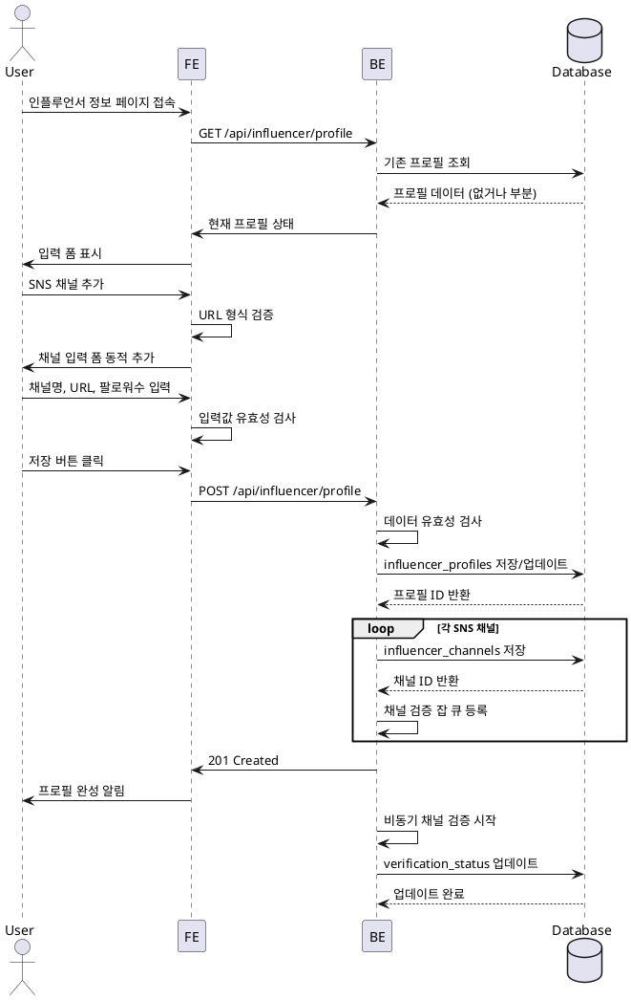

# 인플루언서 정보 등록

## Primary Actor
인플루언서 역할 사용자

## Precondition
- 회원가입 완료
- 인플루언서 역할 선택됨
- 로그인 상태

## Trigger
회원가입 후 리다이렉트 또는 프로필 설정 메뉴 접근

## Main Scenario
1. 인플루언서 정보 입력 페이지 진입
2. SNS 채널 추가 버튼 클릭
3. 채널 유형 선택 (네이버/유튜브/인스타그램/스레드)
4. 채널명, URL, 팔로워수 입력
5. 추가 채널이 있으면 2-4 반복
6. 저장 버튼 클릭
7. 프로필 완성 확인 메시지
8. 홈 페이지로 이동

## Edge Cases
- **잘못된 URL 형식**: 플랫폼별 URL 패턴 검증 실패 시 오류 표시
- **중복 채널**: 동일 URL 중복 등록 방지
- **팔로워수 형식 오류**: 숫자만 입력 가능, 음수 불가
- **채널 검증 실패**: 존재하지 않는 채널 URL 입력 시 검증 대기 상태
- **임시저장 복원**: 브라우저 새로고침 시 입력값 유지

## Business Rules
- 최소 1개 이상의 SNS 채널 필수
- 채널당 최대 10개까지 등록 가능
- 채널 URL은 실제 존재하는 페이지여야 함
- 팔로워수는 0 이상의 정수
- 채널 검증은 비동기로 처리 (등록 후 백그라운드)

## Sequence Diagram

