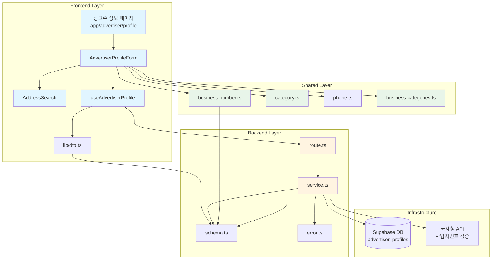

# 광고주 정보 등록 구현 계획

## 개요

광고주 정보 등록 기능을 위한 최소한의 모듈화 설계입니다. 기존 인플루언서 프로필 구조를 참고하여 일관된 패턴으로 구현합니다.

### 모듈 목록

| 모듈 | 위치 | 설명 |
|------|------|------|
| **Backend - Route** | `src/features/advertiser/backend/route.ts` | 광고주 프로필 API 엔드포인트 정의 |
| **Backend - Service** | `src/features/advertiser/backend/service.ts` | 광고주 프로필 비즈니스 로직 및 DB 처리 |
| **Backend - Schema** | `src/features/advertiser/backend/schema.ts` | 요청/응답 Zod 스키마 정의 |
| **Backend - Error** | `src/features/advertiser/backend/error.ts` | 에러 코드 상수 정의 |
| **Frontend - Hook** | `src/features/advertiser/hooks/useAdvertiserProfile.ts` | React Query 기반 상태 관리 훅 |
| **Frontend - Component** | `src/features/advertiser/components/AdvertiserProfileForm.tsx` | 광고주 정보 입력 폼 컴포넌트 |
| **Frontend - Component** | `src/features/advertiser/components/AddressSearch.tsx` | 주소 검색 컴포넌트 (Daum Postcode API) |
| **Frontend - DTO** | `src/features/advertiser/lib/dto.ts` | Backend 스키마 재노출 |
| **Shared - Validation** | `src/lib/validation/business-number.ts` | 사업자등록번호 검증 유틸리티 |
| **Shared - Validation** | `src/lib/validation/category.ts` | 업체 카테고리 상수 및 검증 |
| **Shared - Constants** | `src/constants/business-categories.ts` | 업체 카테고리 상수 정의 |

---

## Diagram



---

## Implementation Plan

### 1. Backend Layer

#### 1.1. Schema Definition (`src/features/advertiser/backend/schema.ts`)

**목적**: 광고주 프로필 요청/응답 데이터 구조 정의

**스키마 목록**:
- `createProfileRequestSchema`: 프로필 생성/업데이트 요청
- `profileResponseSchema`: 프로필 조회 응답
- `businessNumberParamSchema`: 사업자번호 중복 확인 요청

**필드 검증 규칙**:
```typescript
{
  companyName: string (1-200자),
  address: string (1-500자),
  location: string (1-500자),
  storePhone: string (전화번호 형식),
  category: enum (업체 카테고리),
  businessNumber: string (10자리 숫자),
  representativeName: string (1-100자)
}
```

**Unit Test**:
```typescript
describe('advertiser schema validation', () => {
  test('유효한 프로필 데이터 검증 성공', () => {
    const validData = {
      companyName: "테스트 카페",
      address: "서울시 강남구 테헤란로 123",
      location: "강남역 3번 출구",
      storePhone: "02-1234-5678",
      category: "카페/디저트",
      businessNumber: "1234567890",
      representativeName: "홍길동"
    };
    expect(createProfileRequestSchema.parse(validData)).toEqual(validData);
  });

  test('사업자번호 형식 검증 - 10자리 미만 실패', () => {
    const invalidData = { businessNumber: "123456789" };
    expect(() => businessNumberSchema.parse(invalidData)).toThrow();
  });

  test('사업자번호 형식 검증 - 숫자 외 문자 실패', () => {
    const invalidData = { businessNumber: "123-45-6789" };
    expect(() => businessNumberSchema.parse(invalidData)).toThrow();
  });

  test('전화번호 형식 검증 실패', () => {
    const invalidData = { storePhone: "전화번호" };
    expect(() => storePhoneSchema.parse(invalidData)).toThrow();
  });

  test('필수 필드 누락 시 검증 실패', () => {
    const invalidData = { companyName: "테스트" };
    expect(() => createProfileRequestSchema.parse(invalidData)).toThrow();
  });
});
```

---

#### 1.2. Error Code Definition (`src/features/advertiser/backend/error.ts`)

**목적**: 광고주 프로필 관련 에러 코드 정의

**에러 코드**:
```typescript
export const advertiserErrorCodes = {
  profileNotFound: 'PROFILE_NOT_FOUND',
  userNotFound: 'USER_NOT_FOUND',
  invalidRole: 'INVALID_ROLE',
  businessNumberDuplicate: 'BUSINESS_NUMBER_DUPLICATE',
  businessNumberInvalid: 'BUSINESS_NUMBER_INVALID',
  verificationFailed: 'VERIFICATION_FAILED',
  verificationPending: 'VERIFICATION_PENDING',
  unauthorizedAccess: 'UNAUTHORIZED_ACCESS',
  databaseError: 'DATABASE_ERROR',
} as const;
```

---

#### 1.3. Service Layer (`src/features/advertiser/backend/service.ts`)

**목적**: 광고주 프로필 비즈니스 로직 처리

**함수 목록**:

1. **`getAdvertiserProfile(supabase, userId)`**
   - 광고주 프로필 조회
   - 역할 검증 (advertiser만 허용)
   - 프로필 미존재 시 404 반환

2. **`createOrUpdateProfile(supabase, userId, data)`**
   - 프로필 생성 또는 업데이트
   - 사업자번호 중복 확인
   - 프로필 저장 후 비동기 검증 큐 등록
   - is_verified = false로 초기화

3. **`checkBusinessNumberDuplicate(supabase, businessNumber, excludeUserId?)`**
   - 사업자번호 중복 확인
   - 본인 제외 중복 검사

4. **`verifyBusinessNumber(businessNumber)`**
   - 국세청 API 호출 (외부 API - 구현은 mock)
   - 검증 결과 반환

**Unit Test**:
```typescript
describe('advertiser service', () => {
  test('광고주 프로필 조회 성공', async () => {
    const result = await getAdvertiserProfile(supabase, validUserId);
    expect(result.ok).toBe(true);
    expect(result.data).toHaveProperty('companyName');
  });

  test('인플루언서 역할로 광고주 프로필 조회 시 403 에러', async () => {
    const result = await getAdvertiserProfile(supabase, influencerUserId);
    expect(result.ok).toBe(false);
    expect(result.error.code).toBe('INVALID_ROLE');
  });

  test('프로필 생성 성공', async () => {
    const result = await createOrUpdateProfile(supabase, userId, validData);
    expect(result.ok).toBe(true);
    expect(result.status).toBe(201);
  });

  test('사업자번호 중복 시 409 에러', async () => {
    const result = await createOrUpdateProfile(supabase, userId, duplicateData);
    expect(result.ok).toBe(false);
    expect(result.error.code).toBe('BUSINESS_NUMBER_DUPLICATE');
  });

  test('사업자번호 중복 확인 - 중복', async () => {
    const result = await checkBusinessNumberDuplicate(supabase, '1234567890');
    expect(result.data.isDuplicate).toBe(true);
  });

  test('사업자번호 중복 확인 - 미중복', async () => {
    const result = await checkBusinessNumberDuplicate(supabase, '9999999999');
    expect(result.data.isDuplicate).toBe(false);
  });
});
```

---

#### 1.4. Route Handler (`src/features/advertiser/backend/route.ts`)

**목적**: HTTP 엔드포인트 정의 및 요청 처리

**엔드포인트**:

1. **`GET /api/advertiser/profile`**
   - 현재 사용자의 광고주 프로필 조회
   - 인증 확인 (쿠키 기반)
   - 404: 프로필 미존재
   - 403: 권한 없음

2. **`POST /api/advertiser/profile`**
   - 광고주 프로필 생성/업데이트
   - 요청 바디 검증
   - 사업자번호 중복 확인
   - 201: 생성 성공
   - 409: 사업자번호 중복

3. **`GET /api/advertiser/business-number/:businessNumber/duplicate`**
   - 사업자번호 중복 확인
   - 쿼리 파라미터: excludeUserId (선택)

**Unit Test**:
```typescript
describe('advertiser routes', () => {
  test('GET /api/advertiser/profile - 인증 없이 호출 시 401', async () => {
    const res = await request(app).get('/api/advertiser/profile');
    expect(res.status).toBe(401);
  });

  test('GET /api/advertiser/profile - 프로필 조회 성공', async () => {
    const res = await authenticatedRequest(app)
      .get('/api/advertiser/profile');
    expect(res.status).toBe(200);
    expect(res.body.data).toHaveProperty('companyName');
  });

  test('POST /api/advertiser/profile - 생성 성공', async () => {
    const res = await authenticatedRequest(app)
      .post('/api/advertiser/profile')
      .send(validProfileData);
    expect(res.status).toBe(201);
  });

  test('POST /api/advertiser/profile - 잘못된 요청 형식 400', async () => {
    const res = await authenticatedRequest(app)
      .post('/api/advertiser/profile')
      .send({ invalid: 'data' });
    expect(res.status).toBe(400);
  });

  test('POST /api/advertiser/profile - 사업자번호 중복 409', async () => {
    const res = await authenticatedRequest(app)
      .post('/api/advertiser/profile')
      .send(duplicateData);
    expect(res.status).toBe(409);
  });

  test('GET /api/advertiser/business-number/:num/duplicate - 중복 확인', async () => {
    const res = await request(app)
      .get('/api/advertiser/business-number/1234567890/duplicate');
    expect(res.status).toBe(200);
    expect(res.body.data).toHaveProperty('isDuplicate');
  });
});
```

---

### 2. Shared Layer

#### 2.1. Business Number Validation (`src/lib/validation/business-number.ts`)

**목적**: 사업자등록번호 형식 검증 및 변환

**함수**:
```typescript
// 사업자번호 형식 검증 (10자리 숫자)
export function isValidBusinessNumber(value: string): boolean;

// 사업자번호 포맷팅 (123-45-67890)
export function formatBusinessNumber(value: string): string;

// 사업자번호 숫자만 추출 (1234567890)
export function parseBusinessNumber(value: string): string;

// 사업자번호 체크섬 검증 (국세청 알고리즘)
export function validateBusinessNumberChecksum(value: string): boolean;
```

**Unit Test**:
```typescript
describe('business number validation', () => {
  test('유효한 사업자번호 검증 성공', () => {
    expect(isValidBusinessNumber('1234567890')).toBe(true);
  });

  test('9자리 사업자번호 검증 실패', () => {
    expect(isValidBusinessNumber('123456789')).toBe(false);
  });

  test('11자리 사업자번호 검증 실패', () => {
    expect(isValidBusinessNumber('12345678901')).toBe(false);
  });

  test('숫자 외 문자 포함 시 검증 실패', () => {
    expect(isValidBusinessNumber('123-45-6789')).toBe(false);
  });

  test('사업자번호 포맷팅', () => {
    expect(formatBusinessNumber('1234567890')).toBe('123-45-67890');
  });

  test('사업자번호 파싱', () => {
    expect(parseBusinessNumber('123-45-67890')).toBe('1234567890');
  });

  test('체크섬 검증 성공', () => {
    expect(validateBusinessNumberChecksum('1234567890')).toBe(true);
  });

  test('체크섬 검증 실패', () => {
    expect(validateBusinessNumberChecksum('1234567891')).toBe(false);
  });
});
```

---

#### 2.2. Category Validation (`src/lib/validation/category.ts`)

**목적**: 업체 카테고리 검증

**함수**:
```typescript
export function isValidCategory(category: string): boolean;
export function getCategoryLabel(category: string): string;
```

---

#### 2.3. Business Categories (`src/constants/business-categories.ts`)

**목적**: 업체 카테고리 상수 정의

**구조**:
```typescript
export const BUSINESS_CATEGORIES = [
  { value: 'food', label: '음식점' },
  { value: 'cafe', label: '카페/디저트' },
  { value: 'beauty', label: '뷰티/미용' },
  { value: 'health', label: '헬스/피트니스' },
  { value: 'entertainment', label: '문화/엔터테인먼트' },
  { value: 'shopping', label: '쇼핑/리테일' },
  { value: 'service', label: '서비스' },
  { value: 'other', label: '기타' },
] as const;

export type BusinessCategory = typeof BUSINESS_CATEGORIES[number]['value'];
```

---

### 3. Frontend Layer

#### 3.1. React Hook (`src/features/advertiser/hooks/useAdvertiserProfile.ts`)

**목적**: 광고주 프로필 상태 관리 및 API 연동

**훅 구조**:
```typescript
export function useAdvertiserProfile() {
  return {
    // 데이터
    profile: ProfileResponse | null,
    isLoading: boolean,
    error: Error | null,

    // Mutations
    createOrUpdateProfile: (data: CreateProfileRequest) => void,
    isCreatingOrUpdating: boolean,

    checkBusinessNumberDuplicate: (businessNumber: string) => Promise<boolean>,

    // 유틸리티
    refetch: () => void,
  };
}
```

**QA Sheet**:
| 테스트 케이스 | 입력 | 예상 결과 |
|--------------|------|----------|
| 프로필 조회 - 최초 접속 | - | isLoading: true → profile: null |
| 프로필 조회 - 기존 데이터 | 저장된 프로필 존재 | profile 데이터 반환 |
| 프로필 생성 성공 | 유효한 데이터 | Toast 성공 메시지, 프로필 갱신 |
| 프로필 생성 실패 - 중복 사업자번호 | 중복 사업자번호 | Toast 에러 메시지 "이미 등록된 사업자번호입니다" |
| 프로필 생성 실패 - 네트워크 에러 | 네트워크 오류 | Toast 에러 메시지 "네트워크 오류가 발생했습니다" |
| 사업자번호 중복 확인 - 중복 | "1234567890" | true 반환 |
| 사업자번호 중복 확인 - 미중복 | "9999999999" | false 반환 |

---

#### 3.2. Profile Form Component (`src/features/advertiser/components/AdvertiserProfileForm.tsx`)

**목적**: 광고주 정보 입력 폼 UI

**컴포넌트 구조**:
```typescript
interface AdvertiserProfileFormProps {
  initialData?: ProfileResponse;
  onSuccess?: () => void;
}

export function AdvertiserProfileForm({ initialData, onSuccess }: Props) {
  // react-hook-form + zod
  // 필드: 업체명, 주소, 위치, 전화번호, 카테고리, 사업자번호, 대표자명
}
```

**QA Sheet**:
| 테스트 케이스 | 사용자 액션 | 예상 결과 |
|--------------|-----------|----------|
| 필수 필드 누락 | 업체명 미입력 후 저장 | "업체명을 입력해주세요" 에러 표시 |
| 사업자번호 형식 검증 | "123456789" 입력 | "10자리 숫자를 입력해주세요" 에러 표시 |
| 사업자번호 중복 검증 | 기존 사업자번호 입력 | "이미 등록된 사업자번호입니다" 에러 표시 |
| 전화번호 형식 검증 | "전화번호" 입력 | "올바른 전화번호 형식이 아닙니다" 에러 표시 |
| 주소 검색 클릭 | 주소 검색 버튼 클릭 | 다음 우편번호 팝업 오픈 |
| 주소 선택 | 주소 선택 | 주소 필드 자동 입력 |
| 저장 성공 | 유효한 데이터 입력 후 저장 | "저장 완료" Toast, 페이지 리다이렉트 |
| 네트워크 오류 | 저장 시 네트워크 오류 | "네트워크 오류가 발생했습니다. 임시저장 후 재시도해주세요" 에러 표시 |

**필드별 검증**:
| 필드 | 검증 규칙 | 에러 메시지 |
|------|----------|-----------|
| 업체명 | 필수, 1-200자 | "업체명을 입력해주세요" |
| 주소 | 필수, 1-500자 | "주소를 입력해주세요" |
| 위치 | 필수, 1-500자 | "위치를 입력해주세요" |
| 업장 전화번호 | 필수, 전화번호 형식 | "올바른 전화번호 형식이 아닙니다" |
| 카테고리 | 필수, enum | "카테고리를 선택해주세요" |
| 사업자등록번호 | 필수, 10자리 숫자, 중복 불가 | "10자리 숫자를 입력해주세요" / "이미 등록된 사업자번호입니다" |
| 대표자명 | 필수, 1-100자 | "대표자명을 입력해주세요" |

---

#### 3.3. Address Search Component (`src/features/advertiser/components/AddressSearch.tsx`)

**목적**: 다음 우편번호 API 연동 주소 검색

**컴포넌트 구조**:
```typescript
interface AddressSearchProps {
  onSelect: (address: string, zonecode: string) => void;
  disabled?: boolean;
}

export function AddressSearch({ onSelect, disabled }: Props) {
  // Daum Postcode API 연동
}
```

**QA Sheet**:
| 테스트 케이스 | 사용자 액션 | 예상 결과 |
|--------------|-----------|----------|
| 주소 검색 열기 | "주소 검색" 버튼 클릭 | Daum Postcode 팝업 오픈 |
| 주소 선택 | "서울시 강남구 테헤란로 123" 선택 | onSelect 콜백 호출, 주소 필드 자동 입력 |
| 팝업 닫기 | X 버튼 클릭 | 팝업 닫힘, 주소 미입력 |
| disabled 상태 | disabled=true | 버튼 비활성화 |

---

#### 3.4. DTO Export (`src/features/advertiser/lib/dto.ts`)

**목적**: Backend 스키마 재노출

```typescript
export type {
  CreateProfileRequest,
  ProfileResponse,
  BusinessNumberParam,
} from '../backend/schema';
```

---

### 4. Integration Points

#### 4.1. Hono App Registration

**파일**: `src/backend/hono/app.ts`

**변경사항**:
```typescript
import { registerAdvertiserRoutes } from '@/features/advertiser/backend/route';

// ...
registerAdvertiserRoutes(app);
```

---

#### 4.2. 외부 API 연동 (Mock)

**파일**: `src/features/advertiser/backend/service.ts`

**국세청 API 검증** (비동기):
```typescript
async function verifyBusinessNumber(businessNumber: string) {
  // TODO: 실제 국세청 API 연동
  // 현재는 mock으로 처리
  return {
    isValid: true,
    companyName: "테스트 업체",
    representativeName: "홍길동",
  };
}
```

---

## 구현 순서

1. **Shared Layer** (공통 모듈부터 구현)
   - [ ] `src/constants/business-categories.ts`
   - [ ] `src/lib/validation/business-number.ts`
   - [ ] `src/lib/validation/category.ts`

2. **Backend Layer** (API부터 구현)
   - [ ] `src/features/advertiser/backend/error.ts`
   - [ ] `src/features/advertiser/backend/schema.ts`
   - [ ] `src/features/advertiser/backend/service.ts`
   - [ ] `src/features/advertiser/backend/route.ts`
   - [ ] `src/backend/hono/app.ts` (라우트 등록)

3. **Frontend Layer** (UI 구현)
   - [ ] `src/features/advertiser/lib/dto.ts`
   - [ ] `src/features/advertiser/hooks/useAdvertiserProfile.ts`
   - [ ] `src/features/advertiser/components/AddressSearch.tsx`
   - [ ] `src/features/advertiser/components/AdvertiserProfileForm.tsx`
   - [ ] `src/app/advertiser/profile/page.tsx`

---

## 추가 고려사항

### 사업자번호 검증 비동기 처리

- 사업자번호 검증은 저장 후 백그라운드 큐에서 처리
- 검증 완료 전까지 `is_verified = false`
- 검증 완료 후 `is_verified = true`로 업데이트
- 검증 실패 시 사용자에게 알림 (이메일 or 앱 내 알림)

### 주소 검색 API

- Daum Postcode API 사용 (무료)
- CDN: `//t1.daumcdn.net/mapjsapi/bundle/postcode/prod/postcode.v2.js`
- 팝업 또는 임베딩 방식 선택 가능

### 네트워크 오류 처리

- 임시저장 기능은 이번 구현 범위에서 제외
- 에러 메시지만 표시 후 재시도 안내

### 검증 완료 전 체험단 등록 제한

- 체험단 등록 페이지에서 `is_verified === false` 체크
- 검증 대기 중 안내 메시지 표시
- 검증 완료 후 등록 가능

---

## 테스트 전략

### Backend Unit Test
- Jest + Supertest
- Service 레이어 비즈니스 로직 테스트
- Route 레이어 HTTP 요청/응답 테스트
- Schema 검증 테스트

### Frontend QA Sheet
- 수동 테스트 기반 QA Sheet 작성
- 각 컴포넌트별 사용자 시나리오 검증
- 에러 케이스 시나리오 검증

---

## 완료 조건

- [ ] 모든 Backend 모듈 구현 및 Unit Test 통과
- [ ] 모든 Frontend 컴포넌트 구현
- [ ] QA Sheet 기반 수동 테스트 완료
- [ ] 유스케이스 문서의 모든 시나리오 검증
- [ ] Edge Cases 처리 확인
