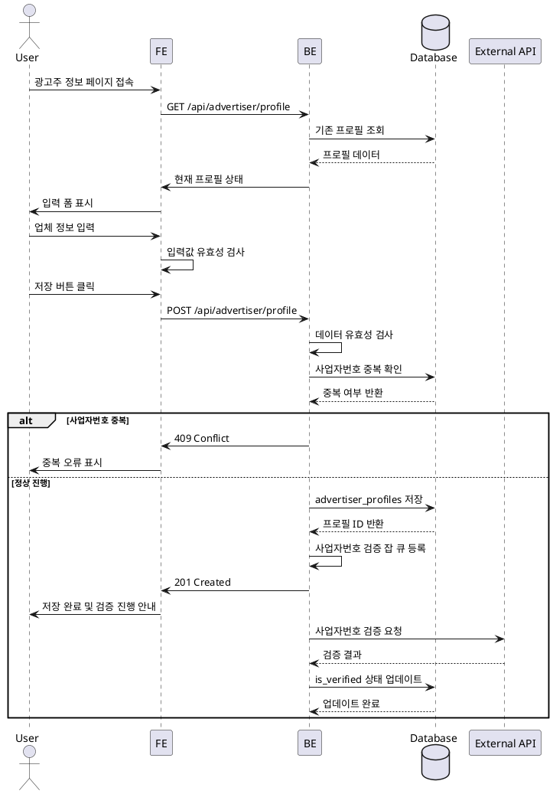

# 광고주 정보 등록

## Primary Actor
광고주 역할 사용자

## Precondition
- 회원가입 완료
- 광고주 역할 선택됨
- 로그인 상태

## Trigger
회원가입 후 리다이렉트 또는 프로필 설정 메뉴 접근

## Main Scenario
1. 광고주 정보 입력 페이지 진입
2. 업체명 입력
3. 주소 입력 (주소 검색)
4. 위치 입력
5. 업장 전화번호 입력
6. 카테고리 선택
7. 사업자등록번호 입력
8. 대표자명 입력
9. 저장 버튼 클릭
10. 사업자번호 검증 진행 안내
11. 체험단 관리 페이지로 이동

## Edge Cases
- **중복 사업자번호**: "이미 등록된 사업자번호입니다" 오류
- **잘못된 사업자번호 형식**: 10자리 형식 검증 실패
- **잘못된 전화번호 형식**: 업장 전화번호 형식 검증 실패
- **사업자번호 검증 실패**: 국세청 API 검증 실패 시 재입력 요청
- **필수 입력 누락**: 필수 필드 강조 표시
- **네트워크 오류**: 임시저장 후 재시도 안내

## Business Rules
- 사업자등록번호는 유일해야 함
- 사업자번호는 10자리 숫자 형식
- 모든 필드는 필수 입력
- 사업자번호 검증은 비동기 처리
- 검증 완료 전까지 체험단 등록 제한

## Sequence Diagram

