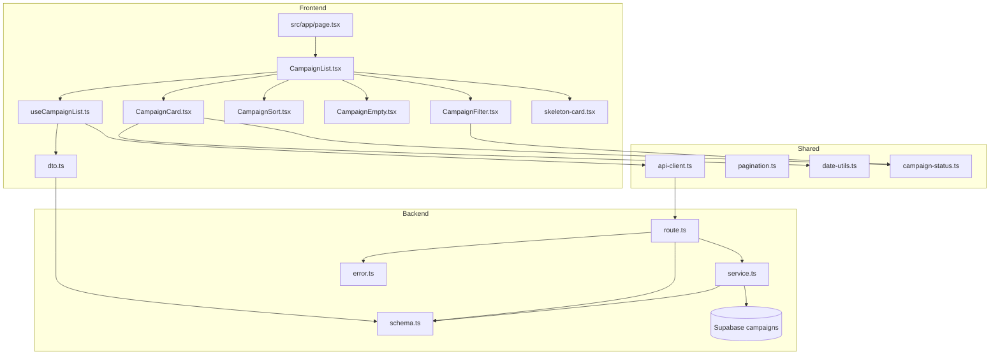

# 홈 & 체험단 목록 탐색 - 구현 계획

## 개요

### 1. Backend Modules

| 모듈명 | 위치 | 설명 |
|--------|------|------|
| Campaign Schema | `src/features/campaign/backend/schema.ts` | 체험단 API 요청/응답 zod 스키마 정의 |
| Campaign Service | `src/features/campaign/backend/service.ts` | Supabase campaigns 테이블 조회 로직 |
| Campaign Routes | `src/features/campaign/backend/route.ts` | Hono 라우터 - 체험단 목록 조회 API |
| Campaign Error | `src/features/campaign/backend/error.ts` | 체험단 관련 에러 코드 정의 |

### 2. Frontend Modules

| 모듈명 | 위치 | 설명 |
|--------|------|------|
| Campaign DTO | `src/features/campaign/lib/dto.ts` | 백엔드 스키마 재노출 |
| Campaign Hooks | `src/features/campaign/hooks/useCampaignList.ts` | React Query 훅 - 체험단 목록 조회 |
| Campaign Card | `src/features/campaign/components/CampaignCard.tsx` | 체험단 카드 컴포넌트 |
| Campaign List | `src/features/campaign/components/CampaignList.tsx` | 체험단 목록 컨테이너 |
| Campaign Filter | `src/features/campaign/components/CampaignFilter.tsx` | 필터 UI (카테고리/지역/모집상태) |
| Campaign Sort | `src/features/campaign/components/CampaignSort.tsx` | 정렬 옵션 UI |
| Campaign Empty | `src/features/campaign/components/CampaignEmpty.tsx` | 빈 목록 UI |
| Campaign Constants | `src/features/campaign/constants/campaign-status.ts` | 캠페인 상태 상수 |

### 3. Shared Modules

| 모듈명 | 위치 | 설명 |
|--------|------|------|
| Pagination Utils | `src/lib/pagination.ts` | 페이징 관련 유틸리티 함수 |
| Date Utils Extension | `src/lib/date-utils.ts` | D-day 계산, 마감임박 판단 함수 |
| Skeleton Card | `src/components/ui/skeleton-card.tsx` | 스켈레톤 UI 컴포넌트 |

### 4. Page & Layout

| 모듈명 | 위치 | 설명 |
|--------|------|------|
| Home Page | `src/app/page.tsx` | 홈 페이지 - 사용자 역할별 버튼 표시 및 체험단 목록 |

---

## Diagram



---

## Implementation Plan

### Phase 1: Backend Infrastructure

#### 1.1 Campaign Schema (`src/features/campaign/backend/schema.ts`)

**목적**: 체험단 목록 조회 API의 요청/응답 스키마 정의

**스키마 정의**:
```typescript
// Query Parameters
- category?: string (옵션)
- status?: 'recruiting' | 'closed' | 'selected' (옵션, 기본값: 'recruiting')
- sort?: 'latest' | 'deadline' (옵션, 기본값: 'latest')
- page?: number (옵션, 기본값: 1)
- limit?: number (옵션, 기본값: 20)

// Response
- id: UUID
- title: string
- recruitmentStart: ISO string
- recruitmentEnd: ISO string
- recruitmentCount: number
- benefits: string
- status: 'recruiting' | 'closed' | 'selected'
- category: string
- companyName: string (advertiser_profiles 조인)
- location: string (advertiser_profiles 조인)
- createdAt: ISO string
- daysRemaining?: number (마감까지 남은 일수)
- isDeadlineSoon: boolean (D-3 이내 여부)

// List Response
- campaigns: CampaignResponse[]
- pagination: { page, limit, total, totalPages }
```

**Unit Test**:
- ✅ 유효한 필터 파라미터 파싱 성공
- ✅ 잘못된 타입 파라미터 검증 실패
- ✅ 기본값 적용 확인

---

#### 1.2 Campaign Service (`src/features/campaign/backend/service.ts`)

**목적**: Supabase에서 체험단 목록 조회

**함수 시그니처**:
```typescript
getCampaignList(
  client: SupabaseClient,
  filters: CampaignListQuery
): Promise<HandlerResult<CampaignListResponse, CampaignServiceError, unknown>>
```

**비즈니스 로직**:
1. campaigns 테이블에서 status 기준 필터링
2. advertiser_profiles 조인하여 광고주 정보 포함
3. category 필터 적용
4. 정렬 옵션 적용:
   - `latest`: created_at DESC
   - `deadline`: recruitment_end ASC
5. 페이징 처리 (limit, offset)
6. daysRemaining 계산 (recruitment_end - today)
7. isDeadlineSoon 판단 (daysRemaining <= 3)

**Unit Test**:
- ✅ status='recruiting' 필터링 정상 조회
- ✅ category 필터 적용 확인
- ✅ 정렬 옵션별 정상 작동
- ✅ 페이징 계산 정확성 검증
- ✅ 빈 결과 반환 처리
- ✅ Supabase 조회 에러 핸들링
- ✅ advertiser_profiles 조인 실패 시 에러

---

#### 1.3 Campaign Routes (`src/features/campaign/backend/route.ts`)

**목적**: Hono 라우터에 GET `/campaigns` 엔드포인트 등록

**엔드포인트**:
```
GET /campaigns
Query: category, status, sort, page, limit
```

**처리 흐름**:
1. Query 파라미터 zod 검증
2. Service 함수 호출
3. 성공/실패 응답 처리

**Unit Test**:
- ✅ 유효한 요청 시 200 응답
- ✅ 잘못된 파라미터 시 400 응답
- ✅ 서비스 에러 시 적절한 HTTP 상태 코드 반환

---

#### 1.4 Campaign Error (`src/features/campaign/backend/error.ts`)

**에러 코드**:
```typescript
- FETCH_ERROR: 조회 실패
- VALIDATION_ERROR: 스키마 검증 실패
- INVALID_PARAMS: 잘못된 요청 파라미터
```

---

### Phase 2: Shared Utilities

#### 2.1 Pagination Utils (`src/lib/pagination.ts`)

**함수**:
```typescript
calculatePagination(page: number, limit: number, total: number): PaginationInfo
calculateOffset(page: number, limit: number): number
```

**Unit Test**:
- ✅ 페이지별 offset 계산 정확성
- ✅ totalPages 계산 정확성
- ✅ 경계값 처리 (page=0, limit=0 등)

---

#### 2.2 Date Utils (`src/lib/date-utils.ts`)

**함수**:
```typescript
calculateDaysRemaining(endDate: string): number
isDeadlineSoon(endDate: string, threshold: number = 3): boolean
```

**Unit Test**:
- ✅ D-day 계산 정확성
- ✅ 마감임박 판단 정확성
- ✅ 과거 날짜 처리

---

#### 2.3 Skeleton Card (`src/components/ui/skeleton-card.tsx`)

**목적**: 로딩 중 스켈레톤 UI 표시

**QA Sheet**:
- ✅ 카드 레이아웃과 동일한 크기
- ✅ 애니메이션 적용
- ✅ 다크모드 대응

---

### Phase 3: Frontend Components

#### 3.1 Campaign Constants (`src/features/campaign/constants/campaign-status.ts`)

**정의**:
```typescript
CAMPAIGN_STATUS = { recruiting, closed, selected }
CAMPAIGN_STATUS_LABELS = { recruiting: '모집중', closed: '모집종료', selected: '선정완료' }
SORT_OPTIONS = [{ value: 'latest', label: '최신순' }, { value: 'deadline', label: '마감임박순' }]
```

---

#### 3.2 Campaign DTO (`src/features/campaign/lib/dto.ts`)

**목적**: 백엔드 스키마를 프론트엔드에서 재사용

```typescript
export {
  CampaignListQuerySchema,
  CampaignResponseSchema,
  CampaignListResponseSchema
} from '@/features/campaign/backend/schema';
export type { CampaignListQuery, CampaignResponse, CampaignListResponse } from '@/features/campaign/backend/schema';
```

---

#### 3.3 Campaign Hooks (`src/features/campaign/hooks/useCampaignList.ts`)

**목적**: React Query를 사용한 체험단 목록 조회

**훅 시그니처**:
```typescript
useCampaignList(filters: CampaignListQuery)
```

**기능**:
- apiClient를 통한 GET 요청
- React Query의 캐싱 활용
- 필터 변경 시 자동 refetch

**QA Sheet**:
- ✅ 초기 로딩 상태 확인
- ✅ 필터 변경 시 refetch 확인
- ✅ 에러 상태 처리 확인
- ✅ 캐싱 동작 확인

---

#### 3.4 Campaign Card (`src/features/campaign/components/CampaignCard.tsx`)

**Props**:
```typescript
campaign: CampaignResponse
```

**UI 요소**:
- 제목
- 광고주명
- 카테고리
- 위치
- 모집 인원
- 모집 기간
- 혜택
- 마감임박 태그 (isDeadlineSoon === true)
- 상태 배지

**QA Sheet**:
- ✅ 마감임박 태그 표시 (D-3 이내)
- ✅ 카테고리별 스타일 적용
- ✅ 클릭 시 상세 페이지 이동 (추후 구현)
- ✅ 반응형 레이아웃
- ✅ hover 효과
- ✅ 이미지 레이지 로딩 (picsum.photos)

---

#### 3.5 Campaign List (`src/features/campaign/components/CampaignList.tsx`)

**Props**:
```typescript
filters: CampaignListQuery
onFilterChange: (filters: CampaignListQuery) => void
```

**기능**:
- useCampaignList 훅 호출
- 로딩 중 스켈레톤 표시
- 빈 목록 시 CampaignEmpty 표시
- CampaignCard 그리드 렌더링
- 더보기 버튼 (다음 페이지 로드)

**QA Sheet**:
- ✅ 초기 로딩 시 스켈레톤 20개 표시
- ✅ 빈 목록 시 안내 메시지 표시
- ✅ 더보기 버튼 클릭 시 다음 페이지 로드
- ✅ 마지막 페이지에서 더보기 버튼 숨김
- ✅ 그리드 레이아웃 반응형

---

#### 3.6 Campaign Filter (`src/features/campaign/components/CampaignFilter.tsx`)

**Props**:
```typescript
filters: CampaignListQuery
onChange: (filters: CampaignListQuery) => void
```

**UI 요소**:
- 카테고리 선택 (BUSINESS_CATEGORIES 재사용)
- 모집상태 선택
- 필터 초기화 버튼

**QA Sheet**:
- ✅ 카테고리 변경 시 onChange 호출
- ✅ 상태 변경 시 onChange 호출
- ✅ 초기화 시 기본값 복원
- ✅ 선택된 필터 강조 표시

---

#### 3.7 Campaign Sort (`src/features/campaign/components/CampaignSort.tsx`)

**Props**:
```typescript
sort: 'latest' | 'deadline'
onChange: (sort: 'latest' | 'deadline') => void
```

**UI 요소**:
- 최신순 / 마감임박순 토글

**QA Sheet**:
- ✅ 정렬 옵션 변경 시 onChange 호출
- ✅ 선택된 정렬 강조 표시

---

#### 3.8 Campaign Empty (`src/features/campaign/components/CampaignEmpty.tsx`)

**UI 요소**:
- "현재 모집 중인 체험단이 없습니다" 메시지
- 필터 재설정 안내

**QA Sheet**:
- ✅ 적절한 아이콘 표시
- ✅ 중앙 정렬
- ✅ 필터 초기화 버튼 제공

---

### Phase 4: Page Integration

#### 4.1 Home Page 수정 (`src/app/page.tsx`)

**변경 사항**:
1. 기존 템플릿 컨텐츠 제거
2. 사용자 역할별 버튼 표시:
   - 인플루언서: "채널 관리" 버튼 → `/onboarding/influencer`
   - 광고주: "광고주 정보 관리" 버튼 → `/onboarding/advertiser`
3. CampaignList, CampaignFilter, CampaignSort 통합
4. 필터 상태 관리 (useState)

**QA Sheet**:
- ✅ 로그인하지 않은 사용자: 로그인/회원가입 버튼만 표시
- ✅ 인플루언서 로그인: "채널 관리" 버튼 표시
- ✅ 광고주 로그인: "광고주 정보 관리" 버튼 표시
- ✅ 체험단 목록 정상 표시
- ✅ 필터/정렬 변경 시 목록 업데이트
- ✅ 반응형 레이아웃

---

## Migration 필요 여부

**현재 campaigns 테이블 구조 확인 결과**: 이미 필요한 컬럼이 모두 존재하므로 추가 마이그레이션 불필요.

단, 카테고리 필터링을 위해 `advertiser_profiles.category`를 조인하여 사용.

---

## 구현 순서

1. **Shared Utils** → Pagination, Date Utils 구현 및 테스트
2. **Backend** → Schema → Service → Routes → Error 순서대로 구현 및 테스트
3. **Frontend Constants** → campaign-status.ts
4. **Frontend DTO** → dto.ts
5. **Frontend Hooks** → useCampaignList.ts
6. **Frontend Components** → Empty → Card → Sort → Filter → List 순서대로 구현
7. **Page Integration** → Home Page 수정

---

## 주의사항

- 모든 컴포넌트는 `"use client"` 지시어 사용
- page.tsx의 params는 반드시 Promise로 처리
- 이미지는 `picsum.photos` 사용
- React Query를 통한 서버 상태 관리
- apiClient를 통한 HTTP 요청
- zod 스키마로 검증
- ts-pattern으로 분기 처리 (필요 시)
- date-fns로 날짜 계산
- 한글 주석 및 메시지는 UTF-8 인코딩 확인
