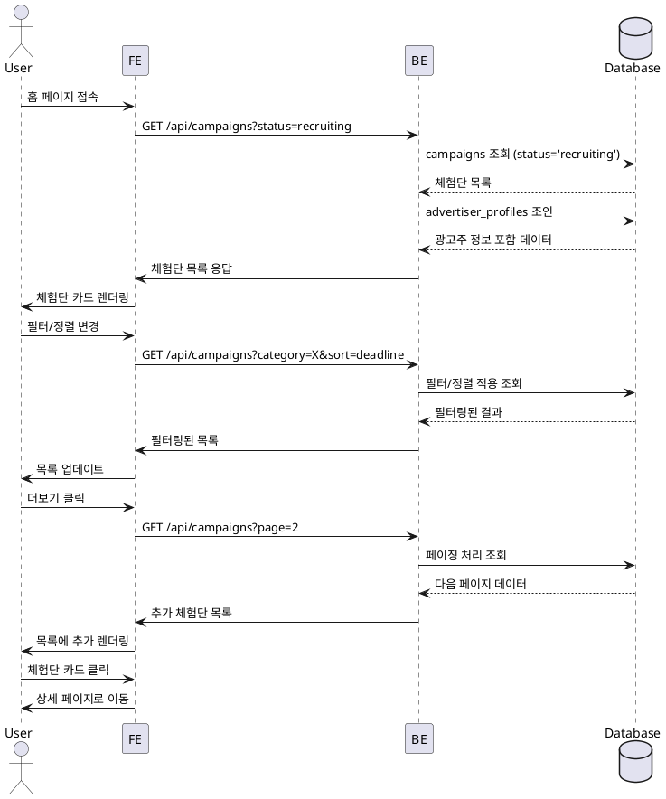

# 홈 & 체험단 목록 탐색

## Primary Actor
모든 로그인 사용자 (인플루언서/광고주)

## Precondition
- 로그인 상태
- 프로필 등록 완료

## Trigger
홈 페이지 접속 또는 체험단 목록 메뉴 클릭

## Main Scenario
1. 홈 페이지 접속
2. 배너 및 추천 체험단 확인
3. 체험단 목록 섹션 스크롤
4. 필터 옵션 선택 (카테고리/지역/모집상태)
5. 정렬 옵션 선택 (최신순/마감임박순)
6. 체험단 카드 목록 확인
7. 더보기 버튼으로 추가 로드
8. 관심있는 체험단 카드 클릭

## Edge Cases
- **빈 목록**: "현재 모집 중인 체험단이 없습니다" 표시
- **필터 결과 없음**: 필터 조건 재설정 안내
- **페이징 오류**: 다시 시도 버튼 제공
- **이미지 로드 실패**: 대체 이미지 표시
- **네트워크 지연**: 스켈레톤 UI 표시

## Business Rules
- 기본 정렬은 최신순
- 한 페이지당 20개 체험단 표시
- 모집종료 D-3 이내는 "마감임박" 태그 표시
- 모집 마감된 체험단은 기본 필터에서 제외
- 이미지는 레이지 로딩 적용

## Sequence Diagram

