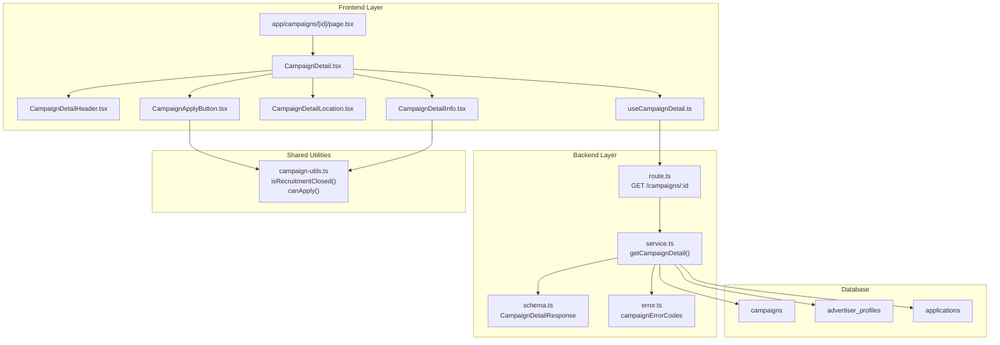

# 체험단 상세 기능 구현 설계

## 개요

체험단 상세 조회 및 지원하기 기능을 구현하기 위한 모듈화 설계입니다.

### 모듈 목록

| 모듈 | 위치 | 설명 |
|------|------|------|
| **Backend - Route** | `src/features/campaign/backend/route.ts` | GET /api/campaigns/:id 엔드포인트 추가 |
| **Backend - Service** | `src/features/campaign/backend/service.ts` | getCampaignDetail 서비스 로직 구현 |
| **Backend - Schema** | `src/features/campaign/backend/schema.ts` | 체험단 상세 응답 스키마 정의 |
| **Backend - Error** | `src/features/campaign/backend/error.ts` | 에러 코드 추가 (notFound, alreadyApplied 등) |
| **Frontend - Hook** | `src/features/campaign/hooks/useCampaignDetail.ts` | 체험단 상세 조회 React Query 훅 |
| **Frontend - Component** | `src/features/campaign/components/CampaignDetail.tsx` | 체험단 상세 메인 컴포넌트 |
| **Frontend - Component** | `src/features/campaign/components/CampaignDetailHeader.tsx` | 헤더 영역 (제목, 광고주) |
| **Frontend - Component** | `src/features/campaign/components/CampaignDetailInfo.tsx` | 정보 영역 (모집기간, 인원, 혜택, 미션) |
| **Frontend - Component** | `src/features/campaign/components/CampaignDetailLocation.tsx` | 매장 정보 및 위치 |
| **Frontend - Component** | `src/features/campaign/components/CampaignApplyButton.tsx` | 지원하기 버튼 (상태별 분기) |
| **Frontend - Page** | `src/app/campaigns/[id]/page.tsx` | 체험단 상세 페이지 |
| **Shared - Utility** | `src/lib/campaign-utils.ts` | 모집 상태 판단 로직 (신규) |

---

## Diagram



---

## Implementation Plan

### 1. Backend - Schema 확장

**파일**: `src/features/campaign/backend/schema.ts`

**작업 내용**:
- `CampaignDetailResponseSchema` 추가
  - 기존 `CampaignResponse`를 확장하여 상세 정보 포함
  - mission, store_info, advertiser 상세 정보 포함
  - hasApplied (현재 사용자의 지원 여부) 포함

**스키마 정의**:
```typescript
export const CampaignDetailResponseSchema = z.object({
  id: z.string().uuid(),
  title: z.string(),
  recruitmentStart: z.string(),
  recruitmentEnd: z.string(),
  recruitmentCount: z.number().int().positive(),
  benefits: z.string(),
  mission: z.string(),
  storeInfo: z.string(),
  status: CampaignStatusSchema,
  category: z.string(),
  companyName: z.string(),
  location: z.string(),
  createdAt: z.string(),
  daysRemaining: z.number().int().optional(),
  isDeadlineSoon: z.boolean(),
  hasApplied: z.boolean(),
  advertiser: z.object({
    id: z.string().uuid(),
    companyName: z.string(),
    location: z.string(),
    category: z.string(),
    storePhone: z.string(),
  }),
});

export type CampaignDetailResponse = z.infer<typeof CampaignDetailResponseSchema>;
```

**Unit Test 시나리오**:
- ✅ 유효한 상세 데이터 파싱 성공
- ✅ mission, storeInfo 필드 존재 검증
- ✅ advertiser 객체 구조 검증
- ✅ hasApplied boolean 필드 검증

---

### 2. Backend - Error 확장

**파일**: `src/features/campaign/backend/error.ts`

**작업 내용**:
- 에러 코드 추가
  - `notFound`: 체험단을 찾을 수 없음
  - `alreadyApplied`: 이미 지원한 체험단

```typescript
export const campaignErrorCodes = {
  fetchError: 'CAMPAIGN_FETCH_ERROR',
  validationError: 'CAMPAIGN_VALIDATION_ERROR',
  invalidParams: 'INVALID_CAMPAIGN_PARAMS',
  notFound: 'CAMPAIGN_NOT_FOUND',
  alreadyApplied: 'CAMPAIGN_ALREADY_APPLIED',
} as const;
```

**Unit Test 시나리오**:
- ✅ 에러 코드 상수 정의 확인
- ✅ TypeScript 타입 추론 검증

---

### 3. Backend - Service 확장

**파일**: `src/features/campaign/backend/service.ts`

**작업 내용**:
- `getCampaignDetail` 함수 구현
  - campaigns 테이블에서 id로 조회
  - advertiser_profiles 조인
  - applications 테이블에서 현재 사용자의 지원 여부 확인
  - 모집 기간 계산 (daysRemaining, isDeadlineSoon)
  - 스키마 검증 후 반환

**함수 시그니처**:
```typescript
export const getCampaignDetail = async (
  client: SupabaseClient,
  campaignId: string,
  userId: string | null
): Promise<
  HandlerResult<CampaignDetailResponse, CampaignServiceError, unknown>
>
```

**Business Logic**:
1. campaigns 테이블에서 id로 단일 조회
2. advertiser_profiles 조인 (inner join)
3. userId가 있는 경우, applications 테이블에서 지원 여부 확인
4. 데이터 매핑 및 계산 로직 적용
5. 스키마 검증 후 반환

**Unit Test 시나리오**:
- ✅ 유효한 campaign_id로 조회 성공
- ✅ 존재하지 않는 campaign_id로 notFound 반환
- ✅ userId가 null인 경우 hasApplied = false
- ✅ userId가 있고 지원 이력이 있는 경우 hasApplied = true
- ✅ advertiser_profiles 조인 데이터 포함 확인
- ✅ daysRemaining 계산 검증
- ✅ isDeadlineSoon 계산 검증 (3일 이내)
- ✅ 스키마 검증 실패 시 validationError 반환

---

### 4. Backend - Route 확장

**파일**: `src/features/campaign/backend/route.ts`

**작업 내용**:
- `GET /campaigns/:id` 엔드포인트 추가
- 쿠키 기반 인증을 통해 userId 추출 (선택적)
- 파라미터 검증 (UUID 형식)
- service 호출 후 respond

**구현 예시**:
```typescript
app.get('/campaigns/:id', async (c) => {
  const campaignId = c.req.param('id');

  // UUID 검증
  const parsedId = z.string().uuid().safeParse(campaignId);
  if (!parsedId.success) {
    return respond(
      c,
      failure(400, campaignErrorCodes.invalidParams, 'Invalid campaign ID')
    );
  }

  // 선택적 인증 (로그인하지 않아도 조회 가능)
  const authSupabase = createServerClient(...);
  const { data: { user } } = await authSupabase.auth.getUser();
  const userId = user?.id ?? null;

  const supabase = getSupabase(c);
  const logger = getLogger(c);

  const result = await getCampaignDetail(supabase, parsedId.data, userId);

  if (!result.ok) {
    logger.error('Failed to fetch campaign detail', result.error.message);
  }

  return respond(c, result);
});
```

**Unit Test 시나리오**:
- ✅ 유효한 UUID로 요청 성공
- ✅ 잘못된 UUID 형식으로 400 반환
- ✅ 로그인한 사용자의 경우 hasApplied 포함
- ✅ 비로그인 사용자의 경우 hasApplied = false
- ✅ 존재하지 않는 ID로 404 반환

---

### 5. Frontend - Hook

**파일**: `src/features/campaign/hooks/useCampaignDetail.ts`

**작업 내용**:
- React Query 기반 훅 구현
- apiClient를 통한 GET 요청
- 에러 처리 및 로딩 상태 관리

**구현 예시**:
```typescript
"use client";

import { useQuery } from "@tanstack/react-query";
import { apiClient } from "@/lib/remote/api-client";
import type { CampaignDetailResponse } from "@/features/campaign/lib/dto";

const fetchCampaignDetail = async (
  campaignId: string
): Promise<CampaignDetailResponse> => {
  const response = await apiClient.get<CampaignDetailResponse>(
    `/campaigns/${campaignId}`
  );
  return response.data;
};

export const useCampaignDetail = (campaignId: string) => {
  return useQuery({
    queryKey: ["campaigns", campaignId],
    queryFn: () => fetchCampaignDetail(campaignId),
    staleTime: 1000 * 60 * 5, // 5분
  });
};
```

**QA Sheet**:
| 시나리오 | 입력 | 기대 결과 |
|---------|------|----------|
| 유효한 ID로 조회 | campaignId = valid UUID | data 반환, isLoading = false |
| 존재하지 않는 ID | campaignId = non-existent UUID | error 상태, 404 |
| 네트워크 에러 | 네트워크 연결 끊김 | error 상태, isError = true |
| 로딩 상태 | 요청 진행 중 | isLoading = true |

---

### 6. Frontend - Shared Utility

**파일**: `src/lib/campaign-utils.ts` (신규 생성)

**작업 내용**:
- 모집 상태 판단 로직을 재사용 가능한 유틸로 분리
- `isRecruitmentClosed`: 모집 종료 여부 판단
- `canApply`: 지원 가능 여부 판단

**구현 예시**:
```typescript
import { parseISO, isAfter, isBefore } from 'date-fns';

/**
 * 모집이 종료되었는지 확인
 */
export const isRecruitmentClosed = (
  recruitmentEnd: string,
  status: string
): boolean => {
  if (status === 'closed' || status === 'selected') {
    return true;
  }

  const endDate = parseISO(recruitmentEnd);
  const now = new Date();

  return isAfter(now, endDate);
};

/**
 * 지원 가능 여부 확인
 */
export const canApply = (
  recruitmentStart: string,
  recruitmentEnd: string,
  status: string,
  hasApplied: boolean
): boolean => {
  // 이미 지원한 경우
  if (hasApplied) {
    return false;
  }

  // 모집 종료
  if (isRecruitmentClosed(recruitmentEnd, status)) {
    return false;
  }

  // 모집 시작 전
  const startDate = parseISO(recruitmentStart);
  const now = new Date();
  if (isBefore(now, startDate)) {
    return false;
  }

  return true;
};
```

**Unit Test 시나리오**:
- ✅ status가 'closed'인 경우 모집 종료
- ✅ status가 'selected'인 경우 모집 종료
- ✅ recruitmentEnd가 과거인 경우 모집 종료
- ✅ recruitmentEnd가 미래인 경우 모집 중
- ✅ hasApplied = true인 경우 지원 불가
- ✅ 모집 기간 내이고 미지원인 경우 지원 가능
- ✅ 모집 시작 전인 경우 지원 불가

---

### 7. Frontend - Components

#### 7.1 CampaignDetailHeader

**파일**: `src/features/campaign/components/CampaignDetailHeader.tsx`

**작업 내용**:
- 체험단 제목, 광고주 정보 표시
- 모집 상태 배지 표시

**Props**:
```typescript
type CampaignDetailHeaderProps = {
  title: string;
  companyName: string;
  category: string;
  status: CampaignStatus;
  isDeadlineSoon: boolean;
};
```

**QA Sheet**:
| 시나리오 | Props | 기대 화면 |
|---------|-------|----------|
| 일반 모집 중 | status = 'recruiting', isDeadlineSoon = false | "모집중" 배지 |
| 마감 임박 | isDeadlineSoon = true | "마감임박" 배지 (빨간색) |
| 모집 마감 | status = 'closed' | "모집마감" 배지 |
| 선정 완료 | status = 'selected' | "선정완료" 배지 |

---

#### 7.2 CampaignDetailInfo

**파일**: `src/features/campaign/components/CampaignDetailInfo.tsx`

**작업 내용**:
- 모집 기간, 모집 인원 표시
- 제공 혜택, 미션 내용 표시
- D-day 계산 및 표시

**Props**:
```typescript
type CampaignDetailInfoProps = {
  recruitmentStart: string;
  recruitmentEnd: string;
  recruitmentCount: number;
  benefits: string;
  mission: string;
  daysRemaining?: number;
};
```

**QA Sheet**:
| 시나리오 | Props | 기대 화면 |
|---------|-------|----------|
| 모집 기간 표시 | recruitmentStart, recruitmentEnd | "2025.01.01 ~ 2025.01.31" |
| 모집 인원 표시 | recruitmentCount = 10 | "모집 인원: 10명" |
| D-day 표시 | daysRemaining = 5 | "D-5" |
| 모집 종료 | daysRemaining = -1 | D-day 미표시 |
| 혜택 내용 | benefits = "무료 식사 제공" | 혜택 섹션에 표시 |
| 미션 내용 | mission = "리뷰 작성" | 미션 섹션에 표시 |

---

#### 7.3 CampaignDetailLocation

**파일**: `src/features/campaign/components/CampaignDetailLocation.tsx`

**작업 내용**:
- 매장 정보 표시 (storeInfo)
- 위치 정보 (location, address)
- 연락처 (storePhone)

**Props**:
```typescript
type CampaignDetailLocationProps = {
  storeInfo: string;
  location: string;
  storePhone: string;
};
```

**QA Sheet**:
| 시나리오 | Props | 기대 화면 |
|---------|-------|----------|
| 매장 정보 표시 | storeInfo = "2층 레스토랑" | "매장 정보: 2층 레스토랑" |
| 위치 표시 | location = "서울 강남구" | 위치 아이콘 + "서울 강남구" |
| 연락처 표시 | storePhone = "02-1234-5678" | 전화 아이콘 + "02-1234-5678" |

---

#### 7.4 CampaignApplyButton

**파일**: `src/features/campaign/components/CampaignApplyButton.tsx`

**작업 내용**:
- 지원 가능 여부에 따른 버튼 상태 변경
- Edge case 처리 (이미 지원, 모집 마감, 권한 없음)
- 버튼 클릭 시 지원 폼으로 이동 (추후 구현)

**Props**:
```typescript
type CampaignApplyButtonProps = {
  campaignId: string;
  recruitmentStart: string;
  recruitmentEnd: string;
  status: CampaignStatus;
  hasApplied: boolean;
  hasInfluencerProfile: boolean; // 추후 context에서 가져올 수 있음
};
```

**QA Sheet**:
| 시나리오 | Props | 기대 화면 |
|---------|-------|----------|
| 지원 가능 | canApply = true | "지원하기" 버튼 활성화 (primary) |
| 이미 지원함 | hasApplied = true | "이미 지원한 체험단입니다" 비활성화 |
| 모집 마감 | status = 'closed' | "모집이 마감되었습니다" 비활성화 |
| 권한 없음 | hasInfluencerProfile = false | "인플루언서 등록이 필요합니다" 안내 |
| 모집 시작 전 | recruitmentStart > now | "모집 예정입니다" 비활성화 |
| 버튼 클릭 | 클릭 | 지원 폼으로 이동 (추후 구현) |

---

#### 7.5 CampaignDetail (Main Component)

**파일**: `src/features/campaign/components/CampaignDetail.tsx`

**작업 내용**:
- useCampaignDetail 훅 사용
- 로딩/에러 상태 처리
- 하위 컴포넌트 조합

**Props**:
```typescript
type CampaignDetailProps = {
  campaignId: string;
};
```

**구현 예시**:
```typescript
"use client";

import { useCampaignDetail } from "@/features/campaign/hooks/useCampaignDetail";
import { CampaignDetailHeader } from "./CampaignDetailHeader";
import { CampaignDetailInfo } from "./CampaignDetailInfo";
import { CampaignDetailLocation } from "./CampaignDetailLocation";
import { CampaignApplyButton } from "./CampaignApplyButton";

export function CampaignDetail({ campaignId }: CampaignDetailProps) {
  const { data, isLoading, error } = useCampaignDetail(campaignId);

  if (isLoading) {
    return <div>로딩 중...</div>;
  }

  if (error) {
    return <div>데이터를 불러올 수 없습니다. <button>새로고침</button></div>;
  }

  if (!data) {
    return <div>체험단을 찾을 수 없습니다.</div>;
  }

  return (
    <div className="container mx-auto p-4">
      <CampaignDetailHeader
        title={data.title}
        companyName={data.companyName}
        category={data.category}
        status={data.status}
        isDeadlineSoon={data.isDeadlineSoon}
      />

      <CampaignDetailInfo
        recruitmentStart={data.recruitmentStart}
        recruitmentEnd={data.recruitmentEnd}
        recruitmentCount={data.recruitmentCount}
        benefits={data.benefits}
        mission={data.mission}
        daysRemaining={data.daysRemaining}
      />

      <CampaignDetailLocation
        storeInfo={data.storeInfo}
        location={data.location}
        storePhone={data.advertiser.storePhone}
      />

      <CampaignApplyButton
        campaignId={data.id}
        recruitmentStart={data.recruitmentStart}
        recruitmentEnd={data.recruitmentEnd}
        status={data.status}
        hasApplied={data.hasApplied}
        hasInfluencerProfile={false} // TODO: context에서 가져오기
      />
    </div>
  );
}
```

**QA Sheet**:
| 시나리오 | 상태 | 기대 화면 |
|---------|------|----------|
| 로딩 중 | isLoading = true | 로딩 스피너 또는 스켈레톤 |
| 데이터 로드 성공 | data 존재 | 모든 하위 컴포넌트 렌더링 |
| 네트워크 에러 | error 발생 | "데이터를 불러올 수 없습니다" + 새로고침 버튼 |
| 404 Not Found | error.status = 404 | "체험단을 찾을 수 없습니다" |

---

### 8. Frontend - Page

**파일**: `src/app/campaigns/[id]/page.tsx`

**작업 내용**:
- Next.js 동적 라우트 페이지 생성
- params에서 id 추출 (Promise 형태로 처리)
- CampaignDetail 컴포넌트 렌더링

**구현 예시**:
```typescript
"use client";

import { CampaignDetail } from "@/features/campaign/components/CampaignDetail";

type PageProps = {
  params: Promise<{
    id: string;
  }>;
};

export default async function CampaignDetailPage({ params }: PageProps) {
  const { id } = await params;

  return (
    <main>
      <CampaignDetail campaignId={id} />
    </main>
  );
}
```

**QA Sheet**:
| 시나리오 | URL | 기대 동작 |
|---------|-----|----------|
| 유효한 ID | /campaigns/abc-123 | CampaignDetail 컴포넌트 렌더링 |
| 잘못된 ID | /campaigns/invalid | 404 에러 처리 (컴포넌트 내부) |

---

### 9. Frontend - DTO 재노출

**파일**: `src/features/campaign/lib/dto.ts`

**작업 내용**:
- backend/schema에서 CampaignDetailResponse 재노출

```typescript
export type {
  // ... existing exports
  CampaignDetailResponse,
} from '@/features/campaign/backend/schema';
```

---

## 구현 순서

1. **Backend Schema & Error** (독립적)
   - schema.ts에 CampaignDetailResponseSchema 추가
   - error.ts에 에러 코드 추가

2. **Backend Service** (Schema 의존)
   - service.ts에 getCampaignDetail 함수 구현
   - Unit test 작성

3. **Backend Route** (Service 의존)
   - route.ts에 GET /campaigns/:id 추가
   - Unit test 작성

4. **Frontend Shared Utility** (독립적)
   - campaign-utils.ts 생성
   - Unit test 작성

5. **Frontend DTO** (Backend Schema 의존)
   - dto.ts에 타입 재노출

6. **Frontend Hook** (DTO 의존)
   - useCampaignDetail.ts 구현

7. **Frontend Components** (Hook, Utility 의존)
   - Header, Info, Location, ApplyButton 컴포넌트 구현
   - QA Sheet 기반 테스트

8. **Frontend Main Component** (하위 컴포넌트 의존)
   - CampaignDetail.tsx 구현

9. **Frontend Page** (Main Component 의존)
   - page.tsx 생성

---

## 테스트 전략

### Backend
- **Unit Test**: 각 service 함수에 대한 단위 테스트
  - Supabase mock을 사용한 격리 테스트
  - 에러 케이스 검증

### Frontend
- **QA Sheet 기반 수동 테스트**
  - 각 컴포넌트별 시나리오 검증
  - Edge case 동작 확인
- **Integration Test** (선택)
  - useCampaignDetail 훅 + apiClient 연동 테스트

---

## 추가 고려 사항

1. **인증 컨텍스트**: 현재는 hasInfluencerProfile을 props로 전달하지만, 추후 Context API나 Zustand로 사용자 인증 상태를 전역 관리할 수 있습니다.

2. **지원하기 기능**: 현재는 버튼만 구현하고, 실제 지원 폼은 별도 유스케이스에서 구현 예정입니다.

3. **SEO**: 서버 컴포넌트로 메타데이터를 생성할 수 있지만, 현재는 클라이언트 컴포넌트 우선 정책에 따라 생략합니다.

4. **에러 바운더리**: 페이지 레벨에서 에러 바운더리를 추가하여 전역 에러 처리를 개선할 수 있습니다.

5. **캐싱 전략**: React Query의 staleTime을 조정하여 데이터 freshness를 관리합니다.
