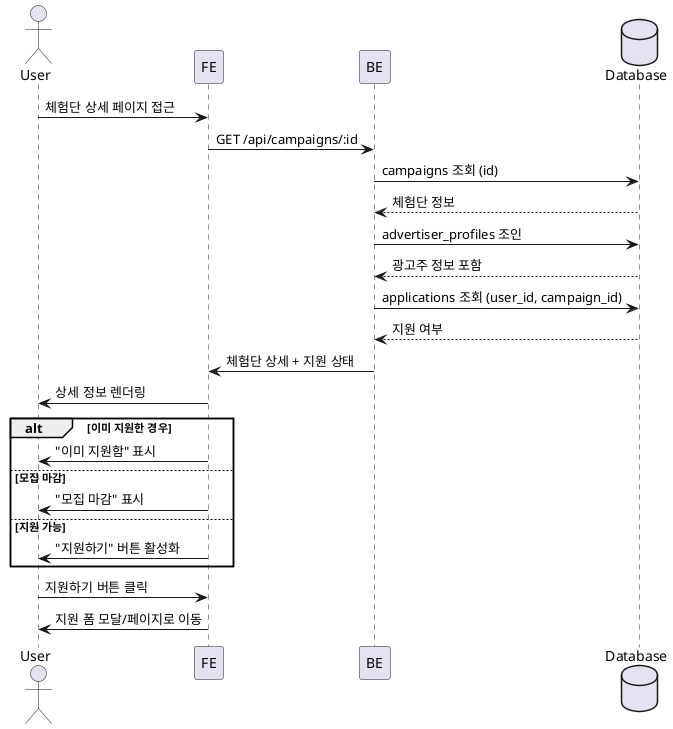

# 체험단 상세

## Primary Actor
인플루언서 역할 사용자

## Precondition
- 로그인 상태
- 인플루언서 프로필 등록 완료

## Trigger
체험단 카드 클릭 또는 직접 URL 접근

## Main Scenario
1. 체험단 상세 페이지 진입
2. 체험단 제목 및 광고주 정보 확인
3. 모집 기간 및 인원 확인
4. 제공 혜택 내용 확인
5. 미션 내용 확인
6. 매장 정보 및 위치 확인
7. 지원하기 버튼 확인
8. 지원하기 버튼 클릭

## Edge Cases
- **모집 마감**: "모집이 마감되었습니다" 표시, 버튼 비활성화
- **이미 지원함**: "이미 지원한 체험단입니다" 표시
- **권한 없음**: 인플루언서 등록 안내 메시지
- **삭제된 체험단**: 404 페이지로 이동
- **데이터 로드 실패**: 새로고침 버튼 제공

## Business Rules
- 모집 기간 내에만 지원 가능
- 인플루언서 프로필 완성 필수
- 중복 지원 불가
- 모집 인원 초과 시에도 지원은 가능 (대기)

## Sequence Diagram

