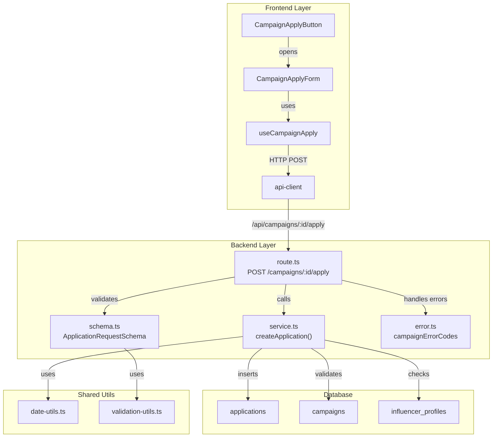

# 체험단 지원 기능 구현 계획

## 개요

인플루언서가 체험단에 지원할 수 있는 기능을 구현합니다. 각오 한마디와 방문 예정일을 입력받아 지원서를 제출하며, 중복 지원 방지와 모집 상태 검증을 수행합니다.

### 모듈 목록

| 모듈 | 위치 | 설명 |
|------|------|------|
| **Backend API Route** | `src/features/campaign/backend/route.ts` | POST /campaigns/:id/apply 라우트 추가 |
| **Backend Service** | `src/features/campaign/backend/service.ts` | createApplication 서비스 로직 |
| **Backend Schema** | `src/features/campaign/backend/schema.ts` | 요청/응답 zod 스키마 정의 |
| **Backend Error** | `src/features/campaign/backend/error.ts` | 지원 관련 에러 코드 추가 |
| **Frontend DTO** | `src/features/campaign/lib/dto.ts` | 스키마 재노출 |
| **Apply Form Component** | `src/features/campaign/components/CampaignApplyForm.tsx` | 지원 폼 UI (Dialog) |
| **Apply Button** | `src/features/campaign/components/CampaignApplyButton.tsx` | 기존 컴포넌트 수정 |
| **React Query Hook** | `src/features/campaign/hooks/useCampaignApply.ts` | 지원 mutation hook |
| **Shared Validation** | `src/lib/validation-utils.ts` | 날짜 검증 유틸리티 (신규) |

---

## Diagram



---

## Implementation Plan

### 1. Backend Layer

#### 1.1 Schema Definition (`src/features/campaign/backend/schema.ts`)

**목적**: 지원 요청/응답 데이터 구조 정의

**추가 스키마**:
```typescript
// 지원 요청 스키마
ApplicationRequestSchema = {
  message: string (min: 10, max: 500),
  visitDate: string (ISO date, future date validation)
}

// 지원 응답 스키마
ApplicationResponseSchema = {
  id: uuid,
  campaignId: uuid,
  influencerId: uuid,
  message: string,
  visitDate: string,
  status: 'applied',
  createdAt: string
}
```

**Unit Tests**:
- ✅ message가 10자 미만일 때 검증 실패
- ✅ message가 500자 초과일 때 검증 실패
- ✅ visitDate가 과거 날짜일 때 검증 실패
- ✅ visitDate가 유효하지 않은 날짜 형식일 때 검증 실패
- ✅ 유효한 데이터일 때 검증 성공

---

#### 1.2 Error Codes (`src/features/campaign/backend/error.ts`)

**목적**: 지원 관련 에러 코드 정의

**추가 에러 코드**:
```typescript
campaignErrorCodes = {
  // 기존 코드...
  alreadyApplied: 'ALREADY_APPLIED',
  recruitmentClosed: 'RECRUITMENT_CLOSED',
  invalidVisitDate: 'INVALID_VISIT_DATE',
  influencerNotFound: 'INFLUENCER_NOT_FOUND',
  applyFailed: 'APPLY_FAILED',
}
```

**Unit Tests**:
- ✅ 모든 에러 코드가 고유한 문자열 값을 가짐
- ✅ 타입 추론이 올바르게 작동

---

#### 1.3 Service Logic (`src/features/campaign/backend/service.ts`)

**목적**: 지원 비즈니스 로직 구현

**함수 시그니처**:
```typescript
export const createApplication = async (
  client: SupabaseClient,
  campaignId: string,
  userId: string,
  request: ApplicationRequest
): Promise<HandlerResult<ApplicationResponse, CampaignServiceError, unknown>>
```

**구현 단계**:
1. 인플루언서 프로필 조회 및 검증
2. 체험단 상태 확인 (모집 중인지, 모집 기간 내인지)
3. 중복 지원 확인
4. 방문 예정일 검증 (캠페인 모집 종료일 이후인지)
5. applications 테이블에 INSERT
6. 결과 반환

**Unit Tests**:
- ✅ 인플루언서 프로필이 없을 때 INFLUENCER_NOT_FOUND 반환
- ✅ 인플루언서가 미인증 상태일 때 INFLUENCER_NOT_FOUND 반환
- ✅ 체험단이 모집 마감 상태일 때 RECRUITMENT_CLOSED 반환
- ✅ 모집 기간이 아닐 때 RECRUITMENT_CLOSED 반환
- ✅ 이미 지원한 체험단일 때 ALREADY_APPLIED 반환
- ✅ 방문 예정일이 과거일 때 INVALID_VISIT_DATE 반환
- ✅ 방문 예정일이 모집 종료일 이전일 때 INVALID_VISIT_DATE 반환
- ✅ 정상적인 지원일 때 지원 정보 반환 (status = 201)
- ✅ DB 삽입 실패 시 APPLY_FAILED 반환

---

#### 1.4 Route Handler (`src/features/campaign/backend/route.ts`)

**목적**: POST /campaigns/:id/apply 엔드포인트 구현

**구현 세부사항**:
- 쿠키에서 사용자 인증 확인 (기존 패턴 재사용)
- 캠페인 ID 파라미터 검증 (UUID)
- 요청 body ApplicationRequestSchema로 검증
- createApplication 서비스 호출
- 에러 처리 및 로깅
- 201 Created 또는 4xx/5xx 응답

**Unit Tests**:
- ✅ 인증되지 않은 요청일 때 401 반환
- ✅ 잘못된 campaignId 형식일 때 400 반환
- ✅ 잘못된 요청 body일 때 400 반환
- ✅ 정상 요청일 때 201 반환

---

### 2. Shared Utils

#### 2.1 Validation Utils (`src/lib/validation-utils.ts`)

**목적**: 재사용 가능한 검증 로직

**함수**:
```typescript
export const isFutureDate = (dateString: string): boolean
export const isAfterDate = (target: string, reference: string): boolean
```

**Unit Tests**:
- ✅ isFutureDate: 오늘 날짜일 때 false
- ✅ isFutureDate: 과거 날짜일 때 false
- ✅ isFutureDate: 미래 날짜일 때 true
- ✅ isAfterDate: target이 reference보다 이전일 때 false
- ✅ isAfterDate: target이 reference보다 이후일 때 true

---

### 3. Frontend Layer

#### 3.1 React Query Hook (`src/features/campaign/hooks/useCampaignApply.ts`)

**목적**: 지원 mutation 관리

**구현**:
```typescript
export const useCampaignApply = (campaignId: string) => {
  return useMutation({
    mutationFn: async (data: ApplicationRequest) => {
      const response = await apiClient.post(`/campaigns/${campaignId}/apply`, data);
      return response.data;
    },
    onSuccess: () => {
      queryClient.invalidateQueries(['campaign', campaignId]);
      // 지원 성공 토스트
    },
    onError: (error) => {
      // 에러 토스트
    }
  });
};
```

**QA Sheet**:
| 시나리오 | 입력 | 기대 결과 |
|---------|------|----------|
| 정상 지원 | 유효한 각오 한마디 + 방문 예정일 | 201 응답, 성공 토스트, 캠페인 상세 재조회 |
| 네트워크 에러 | - | 에러 토스트 표시 |
| 중복 지원 | - | 409 에러, "이미 지원한 체험단입니다" 토스트 |
| 모집 마감 | - | 400 에러, "모집이 마감되었습니다" 토스트 |

---

#### 3.2 Apply Form Component (`src/features/campaign/components/CampaignApplyForm.tsx`)

**목적**: 지원 폼 UI (Dialog)

**컴포넌트 구조**:
```tsx
<Dialog>
  <DialogContent>
    <DialogHeader>
      <DialogTitle>체험단 지원하기</DialogTitle>
    </DialogHeader>
    <Form>
      <FormField name="message">
        <Textarea placeholder="각오 한마디를 입력하세요" />
        <FormDescription>10자 이상 500자 이하</FormDescription>
      </FormField>
      <FormField name="visitDate">
        <Input type="date" min={tomorrow} />
        <FormDescription>방문 예정일을 선택하세요</FormDescription>
      </FormField>
      <DialogFooter>
        <Button variant="outline">취소</Button>
        <Button type="submit" disabled={isSubmitting}>
          지원하기
        </Button>
      </DialogFooter>
    </Form>
  </DialogContent>
</Dialog>
```

**Props**:
- `campaignId: string`
- `open: boolean`
- `onOpenChange: (open: boolean) => void`
- `recruitmentEnd: string` (방문일 검증용)

**Form Validation** (react-hook-form + zod):
- message: 10-500자
- visitDate: 오늘 이후, recruitmentEnd 이후

**QA Sheet**:
| 시나리오 | 동작 | 기대 결과 |
|---------|------|----------|
| 모달 열기 | 지원하기 버튼 클릭 | Dialog 표시 |
| 각오 한마디 10자 미만 입력 | 9자 입력 후 제출 | "최소 10자 이상 입력해주세요" 에러 표시 |
| 각오 한마디 500자 초과 입력 | 501자 입력 후 제출 | "최대 500자까지 입력 가능합니다" 에러 표시 |
| 과거 날짜 선택 | 어제 날짜 선택 | "오늘 이후 날짜를 선택해주세요" 에러 표시 |
| 모집 종료일 이전 날짜 선택 | recruitmentEnd 전 날짜 선택 | "모집 종료일 이후 날짜를 선택해주세요" 에러 표시 |
| 정상 입력 및 제출 | 유효한 데이터 입력 | Loading 상태 표시, 성공 시 모달 닫힘 |
| 제출 중 취소 버튼 클릭 | 제출 중 취소 클릭 | 버튼 비활성화 상태 유지 |
| 네트워크 에러 | 서버 에러 발생 | 에러 메시지 표시, 모달 유지, 재시도 가능 |
| 중복 지원 에러 | 이미 지원한 상태에서 제출 | "이미 지원한 체험단입니다" 에러, 모달 닫힘 |
| ESC 키로 모달 닫기 | ESC 키 입력 | 입력 내용 초기화 경고 없이 모달 닫힘 |
| 배경 클릭으로 모달 닫기 | Dialog 외부 클릭 | 입력 내용 초기화 경고 없이 모달 닫힘 |

---

#### 3.3 Apply Button Update (`src/features/campaign/components/CampaignApplyButton.tsx`)

**목적**: 기존 버튼에 Dialog 트리거 추가

**변경 사항**:
```tsx
const [isDialogOpen, setIsDialogOpen] = useState(false);

const handleClick = () => {
  setIsDialogOpen(true);
};

return (
  <>
    <div className="sticky bottom-0 border-t bg-white p-4">
      <Button onClick={handleClick} disabled={...} variant={...}>
        {buttonProps.text}
      </Button>
    </div>

    <CampaignApplyForm
      campaignId={campaignId}
      open={isDialogOpen}
      onOpenChange={setIsDialogOpen}
      recruitmentEnd={recruitmentEnd}
    />
  </>
);
```

**QA Sheet**:
| 시나리오 | 동작 | 기대 결과 |
|---------|------|----------|
| 지원 가능 상태에서 버튼 클릭 | 지원하기 버튼 클릭 | CampaignApplyForm Dialog 열림 |
| 인플루언서 미등록 상태 | 버튼 표시 | "인플루언서 등록이 필요합니다" 비활성화 버튼 |
| 이미 지원한 상태 | 버튼 표시 | "이미 지원한 체험단입니다" 비활성화 버튼 |
| 모집 마감 상태 | 버튼 표시 | "모집이 마감되었습니다" 비활성화 버튼 |
| 지원 성공 후 | 지원 완료 | hasApplied=true로 변경, 버튼 비활성화 |

---

#### 3.4 DTO Export (`src/features/campaign/lib/dto.ts`)

**목적**: 백엔드 스키마를 프론트엔드에서 재사용

**추가 export**:
```typescript
export {
  ApplicationRequestSchema,
  ApplicationResponseSchema,
  type ApplicationRequest,
  type ApplicationResponse,
} from '../backend/schema';
```

---

## 구현 순서

1. **Shared Utils**
   - `src/lib/validation-utils.ts` 생성 및 테스트

2. **Backend Schema**
   - `src/features/campaign/backend/schema.ts` 스키마 추가
   - Unit tests 작성

3. **Backend Error**
   - `src/features/campaign/backend/error.ts` 에러 코드 추가

4. **Backend Service**
   - `src/features/campaign/backend/service.ts` createApplication 구현
   - Unit tests 작성

5. **Backend Route**
   - `src/features/campaign/backend/route.ts` POST 라우트 추가
   - Integration test

6. **Frontend DTO**
   - `src/features/campaign/lib/dto.ts` 스키마 재노출

7. **Frontend Hook**
   - `src/features/campaign/hooks/useCampaignApply.ts` 구현

8. **Frontend Components**
   - `src/features/campaign/components/CampaignApplyForm.tsx` 구현
   - `src/features/campaign/components/CampaignApplyButton.tsx` 수정
   - QA 진행

---

## 외부 의존성

### Supabase 테이블
- ✅ `applications` (이미 존재)
- ✅ `campaigns` (이미 존재)
- ✅ `influencer_profiles` (이미 존재)

### NPM 패키지
- 모두 기존 패키지 사용 (추가 설치 불필요)
  - `zod`
  - `react-hook-form`
  - `@tanstack/react-query`
  - `date-fns`
  - `axios`

### Shadcn-ui Components
필요 시 추가 설치:
```bash
$ npx shadcn@latest add dialog
$ npx shadcn@latest add textarea
$ npx shadcn@latest add form
```

---

## 성공 기준

- [ ] 인플루언서가 체험단 상세 페이지에서 지원 가능
- [ ] 각오 한마디 10-500자 검증
- [ ] 방문 예정일 오늘 이후 날짜만 선택 가능
- [ ] 중복 지원 방지 (이미 지원한 체험단에는 재지원 불가)
- [ ] 모집 마감된 체험단에는 지원 불가
- [ ] 지원 성공 시 캠페인 상세 데이터 자동 갱신
- [ ] 모든 edge case 에러 메시지 정확하게 표시
- [ ] 전체 QA 시나리오 통과
