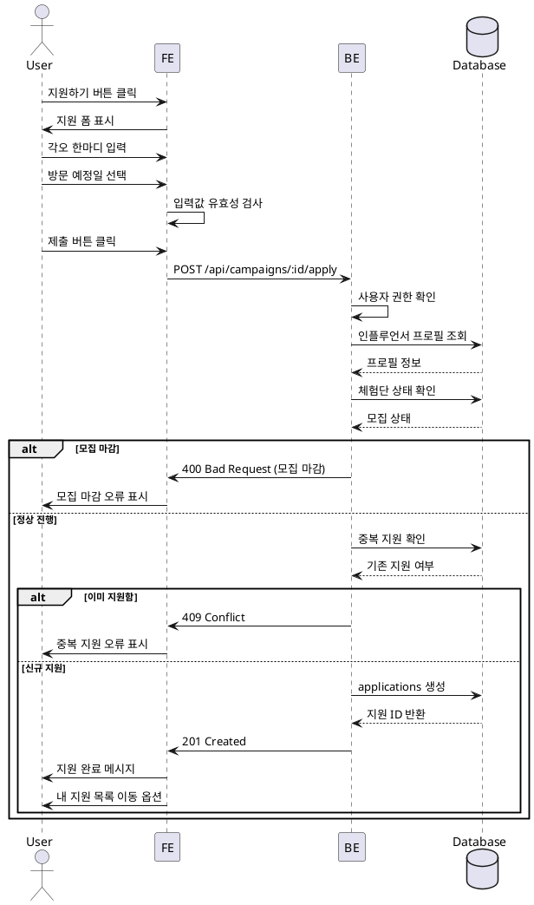

# 체험단 지원

## Primary Actor
인플루언서 역할 사용자

## Precondition
- 로그인 상태
- 인플루언서 프로필 등록 완료
- 체험단 모집 기간 내
- 해당 체험단 미지원 상태

## Trigger
체험단 상세 페이지에서 "지원하기" 버튼 클릭

## Main Scenario
1. 지원하기 버튼 클릭
2. 지원 폼 모달/페이지 표시
3. 각오 한마디 입력
4. 방문 예정일자 선택
5. 입력 내용 확인
6. 제출 버튼 클릭
7. 지원 완료 확인 메시지
8. 내 지원 목록으로 이동 옵션 제공

## Edge Cases
- **중복 지원**: "이미 지원한 체험단입니다" 오류
- **모집 마감**: "모집이 마감되었습니다" 오류
- **필수 입력 누락**: 필수 필드 강조 및 안내
- **과거 날짜 선택**: "방문 예정일은 오늘 이후여야 합니다" 오류
- **서버 오류**: 재시도 버튼 제공, 입력값 유지

## Business Rules
- 한 체험단에 1회만 지원 가능
- 방문 예정일은 오늘 이후 날짜만 선택 가능
- 각오 한마디는 최소 10자, 최대 500자
- 지원 취소 기능은 제공하지 않음
- 지원 시점의 타임스탬프 기록

## Sequence Diagram

