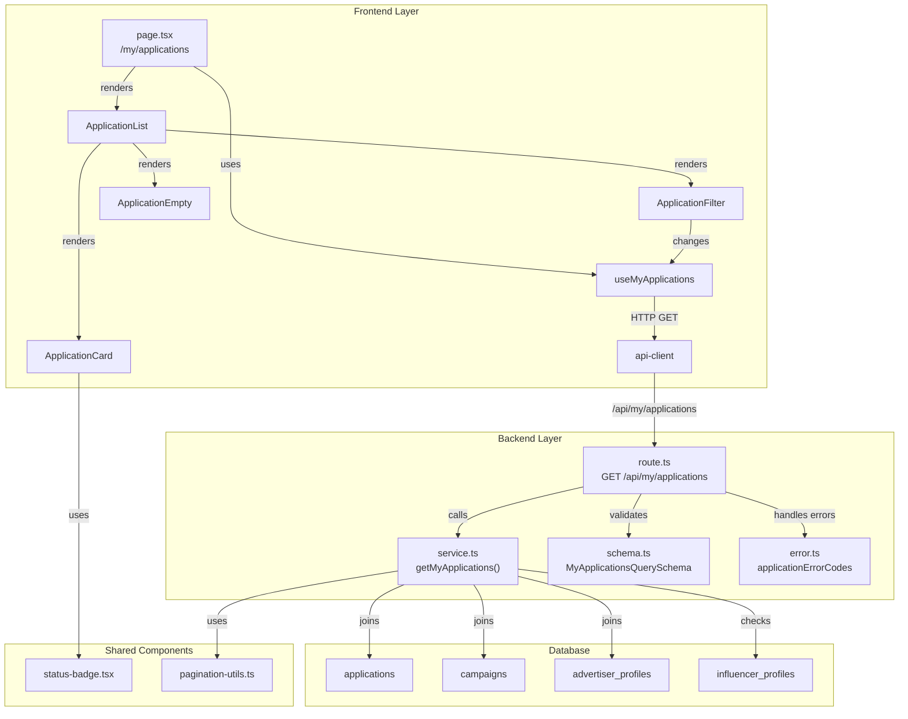

# 내 지원 목록 기능 구현 계획

## 개요

인플루언서가 자신이 지원한 체험단 목록을 조회하고, 상태별로 필터링할 수 있는 마이페이지 기능을 구현합니다.

### 모듈 목록

| 모듈 | 위치 | 설명 |
|------|------|------|
| **Backend API Route** | `src/features/application/backend/route.ts` | GET /api/my/applications 라우트 |
| **Backend Service** | `src/features/application/backend/service.ts` | getMyApplications 서비스 로직 |
| **Backend Schema** | `src/features/application/backend/schema.ts` | 요청/응답 zod 스키마 정의 |
| **Backend Error** | `src/features/application/backend/error.ts` | 지원 목록 관련 에러 코드 |
| **Frontend DTO** | `src/features/application/lib/dto.ts` | 스키마 재노출 |
| **Application List Page** | `src/app/my/applications/page.tsx` | 지원 목록 페이지 |
| **Application List Component** | `src/features/application/components/ApplicationList.tsx` | 지원 목록 렌더링 |
| **Application Card** | `src/features/application/components/ApplicationCard.tsx` | 개별 지원 내역 카드 |
| **Application Filter** | `src/features/application/components/ApplicationFilter.tsx` | 상태 필터 UI |
| **Application Empty** | `src/features/application/components/ApplicationEmpty.tsx` | 빈 상태 UI |
| **React Query Hook** | `src/features/application/hooks/useMyApplications.ts` | 지원 목록 조회 hook |
| **Shared Status Badge** | `src/components/ui/status-badge.tsx` | 상태 태그 공통 컴포넌트 |

---

## Diagram



---

## Implementation Plan

### 1. Backend Layer

#### 1.1 Schema Definition (`src/features/application/backend/schema.ts`)

**목적**: 지원 목록 조회 요청/응답 데이터 구조 정의

**스키마**:
```typescript
// 지원 상태 enum
ApplicationStatusSchema = z.enum(['applied', 'selected', 'rejected'])

// 지원 목록 조회 쿼리
MyApplicationsQuerySchema = {
  status?: 'applied' | 'selected' | 'rejected',  // 선택적 필터
  page?: number (default: 1),
  limit?: number (default: 10, max: 50)
}

// 지원 내역 테이블 row (DB 조회 결과)
ApplicationTableRowSchema = {
  id: uuid,
  campaign_id: uuid,
  message: string,
  visit_date: string,
  status: ApplicationStatusSchema,
  created_at: string,
  campaigns: {
    id: uuid,
    title: string,
    recruitment_end: string,
    status: CampaignStatusSchema,
    advertiser_profiles: {
      company_name: string,
      location: string,
      category: string
    }
  }
}

// 지원 내역 응답
MyApplicationResponseSchema = {
  id: uuid,
  message: string,
  visitDate: string,
  status: ApplicationStatusSchema,
  appliedAt: string,
  campaign: {
    id: uuid,
    title: string,
    companyName: string,
    location: string,
    category: string,
    recruitmentEnd: string,
    status: CampaignStatusSchema,
    isDeleted: boolean
  }
}

// 지원 목록 응답
MyApplicationsResponseSchema = {
  applications: MyApplicationResponseSchema[],
  pagination: PaginationSchema
}
```

**Unit Tests**:
- ✅ status가 유효하지 않은 값일 때 검증 실패
- ✅ page가 음수일 때 검증 실패
- ✅ limit이 50 초과일 때 검증 실패
- ✅ 유효한 쿼리일 때 검증 성공
- ✅ 테이블 row 스키마 검증 성공

---

#### 1.2 Error Codes (`src/features/application/backend/error.ts`)

**목적**: 지원 목록 관련 에러 코드 정의

**에러 코드**:
```typescript
applicationErrorCodes = {
  invalidParams: 'INVALID_PARAMS',
  fetchError: 'FETCH_ERROR',
  influencerNotFound: 'INFLUENCER_NOT_FOUND',
  unauthorized: 'UNAUTHORIZED',
}
```

**Unit Tests**:
- ✅ 모든 에러 코드가 고유한 문자열 값을 가짐
- ✅ 타입 추론이 올바르게 작동

---

#### 1.3 Service Logic (`src/features/application/backend/service.ts`)

**목적**: 지원 목록 조회 비즈니스 로직 구현

**함수 시그니처**:
```typescript
export const getMyApplications = async (
  client: SupabaseClient,
  userId: string,
  filters: MyApplicationsQuery
): Promise<HandlerResult<MyApplicationsResponse, ApplicationServiceError, unknown>>
```

**구현 단계**:
1. 인플루언서 프로필 조회 (user_id → influencer_profile.id)
2. applications 테이블 조회 (influencer_id 필터)
   - campaigns 조인
   - advertiser_profiles 조인
   - status 필터 적용 (선택적)
3. 페이지네이션 적용 (offset, limit)
4. 최신순 정렬 (created_at DESC)
5. 삭제된 체험단 처리 (campaigns가 null인 경우)
6. 응답 매핑 (snake_case → camelCase)

**Unit Tests**:
- ✅ 인플루언서 프로필이 없을 때 INFLUENCER_NOT_FOUND 반환
- ✅ status 필터가 applied일 때 applied만 반환
- ✅ status 필터가 없을 때 전체 반환
- ✅ 페이지네이션이 올바르게 적용됨
- ✅ 삭제된 체험단은 isDeleted=true로 표시
- ✅ 정렬이 created_at DESC로 적용됨
- ✅ DB 조회 실패 시 FETCH_ERROR 반환

---

#### 1.4 Route Handler (`src/features/application/backend/route.ts`)

**목적**: GET /api/my/applications 엔드포인트 구현

**구현 세부사항**:
- 쿠키에서 사용자 인증 확인 (기존 패턴 재사용)
- 쿼리 파라미터 MyApplicationsQuerySchema로 검증
- getMyApplications 서비스 호출
- 에러 처리 및 로깅
- 200 OK 또는 4xx/5xx 응답

**라우트 등록**:
- `src/backend/hono/app.ts`에 `registerApplicationRoutes(app)` 추가

**Unit Tests**:
- ✅ 인증되지 않은 요청일 때 401 반환
- ✅ 잘못된 쿼리 파라미터일 때 400 반환
- ✅ 정상 요청일 때 200 반환
- ✅ 인플루언서 프로필 없을 때 404 반환

---

### 2. Shared Components

#### 2.1 Status Badge (`src/components/ui/status-badge.tsx`)

**목적**: 상태 태그 공통 컴포넌트 (재사용 가능)

**Props**:
```typescript
type StatusBadgeProps = {
  status: 'applied' | 'selected' | 'rejected';
  size?: 'sm' | 'md' | 'lg';
}
```

**스타일 매핑**:
- `applied`: 회색 배경 (pending 느낌)
- `selected`: 녹색 배경 (success)
- `rejected`: 빨간색 배경 (error)

**텍스트 매핑**:
- `applied`: "신청완료"
- `selected`: "선정"
- `rejected`: "반려"

**QA Sheet**:
| 시나리오 | Props | 기대 결과 |
|---------|-------|----------|
| applied 상태 | status="applied" | 회색 배경, "신청완료" 텍스트 |
| selected 상태 | status="selected" | 녹색 배경, "선정" 텍스트 |
| rejected 상태 | status="rejected" | 빨간색 배경, "반려" 텍스트 |
| 크기 변경 | size="sm" | 작은 크기로 렌더링 |

---

### 3. Frontend Layer

#### 3.1 React Query Hook (`src/features/application/hooks/useMyApplications.ts`)

**목적**: 지원 목록 조회 관리

**구현**:
```typescript
export const useMyApplications = (filters: MyApplicationsQuery) => {
  return useQuery({
    queryKey: ['my-applications', filters],
    queryFn: async () => {
      const params = new URLSearchParams();
      if (filters.status) params.append('status', filters.status);
      params.append('page', String(filters.page ?? 1));
      params.append('limit', String(filters.limit ?? 10));

      const response = await apiClient.get<MyApplicationsResponse>(
        `/my/applications?${params.toString()}`
      );
      return response.data;
    },
    staleTime: 1000 * 60 * 5, // 5분
  });
};
```

**QA Sheet**:
| 시나리오 | 입력 | 기대 결과 |
|---------|------|----------|
| 전체 조회 | status=undefined | 모든 지원 내역 반환 |
| applied 필터 | status="applied" | 신청완료만 반환 |
| selected 필터 | status="selected" | 선정만 반환 |
| rejected 필터 | status="rejected" | 반려만 반환 |
| 페이지네이션 | page=2, limit=10 | 11~20번째 항목 반환 |

---

#### 3.2 Application Card (`src/features/application/components/ApplicationCard.tsx`)

**목적**: 개별 지원 내역 카드 UI

**Props**:
```typescript
type ApplicationCardProps = {
  application: MyApplicationResponse;
}
```

**컴포넌트 구조**:
```tsx
<Card>
  <CardHeader>
    <div className="flex justify-between items-start">
      <div>
        <CardTitle>{campaign.title}</CardTitle>
        <CardDescription>
          {campaign.companyName} · {campaign.location}
        </CardDescription>
      </div>
      <StatusBadge status={status} />
    </div>
  </CardHeader>
  <CardContent>
    <div className="space-y-2 text-sm">
      <div>
        <span className="text-muted-foreground">지원일시:</span>
        <span>{format(appliedAt, 'yyyy.MM.dd HH:mm')}</span>
      </div>
      <div>
        <span className="text-muted-foreground">방문예정일:</span>
        <span>{format(visitDate, 'yyyy.MM.dd')}</span>
      </div>
      <div>
        <span className="text-muted-foreground">각오 한마디:</span>
        <p className="mt-1">{message}</p>
      </div>
    </div>
  </CardContent>
  <CardFooter>
    {campaign.isDeleted ? (
      <Button disabled variant="ghost">삭제된 체험단</Button>
    ) : (
      <Link href={`/campaigns/${campaign.id}`}>
        <Button variant="outline">체험단 보기</Button>
      </Link>
    )}
  </CardFooter>
</Card>
```

**QA Sheet**:
| 시나리오 | 데이터 | 기대 결과 |
|---------|-------|----------|
| 정상 지원 내역 | 모든 필드 존재 | 카드 정상 렌더링 |
| 선정된 지원 | status="selected" | 녹색 "선정" 배지 표시 |
| 삭제된 체험단 | campaign.isDeleted=true | "삭제된 체험단" 버튼 비활성화 |
| 체험단 보기 클릭 | - | /campaigns/:id로 이동 |
| 긴 각오 한마디 | message 200자 | 줄바꿈 처리, overflow 방지 |

---

#### 3.3 Application Filter (`src/features/application/components/ApplicationFilter.tsx`)

**목적**: 상태 필터 UI

**Props**:
```typescript
type ApplicationFilterProps = {
  currentStatus?: 'applied' | 'selected' | 'rejected';
  onChange: (status?: 'applied' | 'selected' | 'rejected') => void;
}
```

**컴포넌트 구조**:
```tsx
<Tabs value={currentStatus ?? 'all'} onValueChange={handleChange}>
  <TabsList>
    <TabsTrigger value="all">전체</TabsTrigger>
    <TabsTrigger value="applied">신청완료</TabsTrigger>
    <TabsTrigger value="selected">선정</TabsTrigger>
    <TabsTrigger value="rejected">반려</TabsTrigger>
  </TabsList>
</Tabs>
```

**QA Sheet**:
| 시나리오 | 동작 | 기대 결과 |
|---------|------|----------|
| 전체 탭 클릭 | value="all" | onChange(undefined) 호출 |
| 신청완료 탭 클릭 | value="applied" | onChange("applied") 호출 |
| 선정 탭 클릭 | value="selected" | onChange("selected") 호출 |
| 반려 탭 클릭 | value="rejected" | onChange("rejected") 호출 |

---

#### 3.4 Application List (`src/features/application/components/ApplicationList.tsx`)

**목적**: 지원 목록 렌더링 및 상태 관리

**Props**:
```typescript
type ApplicationListProps = {
  filters: MyApplicationsQuery;
  onFilterChange: (filters: MyApplicationsQuery) => void;
}
```

**컴포넌트 구조**:
```tsx
function ApplicationList({ filters, onFilterChange }) {
  const { data, isLoading, error } = useMyApplications(filters);

  if (isLoading) return <SkeletonCard count={10} />;
  if (error) return <ErrorMessage onRetry={...} />;
  if (!data || data.applications.length === 0) {
    return <ApplicationEmpty currentStatus={filters.status} />;
  }

  return (
    <div className="space-y-6">
      <ApplicationFilter
        currentStatus={filters.status}
        onChange={(status) => onFilterChange({ ...filters, status, page: 1 })}
      />

      <div className="space-y-4">
        {data.applications.map((application) => (
          <ApplicationCard key={application.id} application={application} />
        ))}
      </div>

      {data.pagination.hasNextPage && (
        <Button onClick={handleLoadMore}>더보기</Button>
      )}
    </div>
  );
}
```

**QA Sheet**:
| 시나리오 | 상태 | 기대 결과 |
|---------|------|----------|
| 로딩 중 | isLoading=true | Skeleton 카드 10개 표시 |
| 에러 발생 | error=true | 에러 메시지 및 재시도 버튼 |
| 빈 목록 | applications=[] | ApplicationEmpty 표시 |
| 정상 목록 | applications=[...] | 카드 목록 렌더링 |
| 더보기 클릭 | hasNextPage=true | page + 1로 필터 업데이트 |
| 필터 변경 | - | page=1로 리셋, status 업데이트 |

---

#### 3.5 Application Empty (`src/features/application/components/ApplicationEmpty.tsx`)

**목적**: 빈 상태 UI

**Props**:
```typescript
type ApplicationEmptyProps = {
  currentStatus?: 'applied' | 'selected' | 'rejected';
}
```

**컴포넌트 구조**:
```tsx
<div className="flex flex-col items-center justify-center py-16 text-center">
  <div className="mb-4 text-6xl">📋</div>
  <h3 className="mb-2 text-lg font-semibold">
    {currentStatus ? getEmptyMessage(currentStatus) : "아직 지원한 체험단이 없습니다"}
  </h3>
  <p className="mb-6 text-sm text-muted-foreground">
    체험단에 지원하고 다양한 혜택을 받아보세요
  </p>
  <Link href="/campaigns">
    <Button>체험단 둘러보기</Button>
  </Link>
</div>
```

**메시지 매핑**:
- `applied`: "신청완료 상태의 지원 내역이 없습니다"
- `selected`: "선정된 지원 내역이 없습니다"
- `rejected`: "반려된 지원 내역이 없습니다"

**QA Sheet**:
| 시나리오 | Props | 기대 결과 |
|---------|-------|----------|
| 전체 빈 상태 | currentStatus=undefined | "아직 지원한 체험단이 없습니다" |
| applied 필터 빈 상태 | currentStatus="applied" | "신청완료 상태의 지원 내역이 없습니다" |
| 체험단 둘러보기 클릭 | - | /campaigns로 이동 |

---

#### 3.6 Page Component (`src/app/my/applications/page.tsx`)

**목적**: 지원 목록 페이지 라우트

**구현**:
```tsx
"use client";

import { useState } from "react";
import { ApplicationList } from "@/features/application/components/ApplicationList";
import type { MyApplicationsQuery } from "@/features/application/lib/dto";

export default async function MyApplicationsPage() {
  const [filters, setFilters] = useState<MyApplicationsQuery>({
    page: 1,
    limit: 10,
  });

  return (
    <div className="container mx-auto py-8">
      <h1 className="mb-6 text-3xl font-bold">내 지원 목록</h1>

      <ApplicationList
        filters={filters}
        onFilterChange={setFilters}
      />
    </div>
  );
}
```

**QA Sheet**:
| 시나리오 | 동작 | 기대 결과 |
|---------|------|----------|
| 페이지 접근 | /my/applications 접속 | 전체 지원 목록 표시 |
| 비로그인 상태 | - | 401 에러, 로그인 페이지로 리다이렉트 |
| 인플루언서 미등록 | - | 404 에러, "인플루언서 프로필을 등록해주세요" 메시지 |

---

#### 3.7 DTO Export (`src/features/application/lib/dto.ts`)

**목적**: 백엔드 스키마를 프론트엔드에서 재사용

**Export**:
```typescript
export {
  ApplicationStatusSchema,
  MyApplicationsQuerySchema,
  MyApplicationResponseSchema,
  MyApplicationsResponseSchema,
  type ApplicationStatus,
  type MyApplicationsQuery,
  type MyApplicationResponse,
  type MyApplicationsResponse,
} from '../backend/schema';
```

---

## 구현 순서

1. **Backend Schema**
   - `src/features/application/backend/schema.ts` 생성
   - Unit tests 작성

2. **Backend Error**
   - `src/features/application/backend/error.ts` 생성

3. **Backend Service**
   - `src/features/application/backend/service.ts` 생성
   - Unit tests 작성

4. **Backend Route**
   - `src/features/application/backend/route.ts` 생성
   - `src/backend/hono/app.ts`에 라우트 등록

5. **Shared Components**
   - `src/components/ui/status-badge.tsx` 생성

6. **Frontend DTO**
   - `src/features/application/lib/dto.ts` 생성

7. **Frontend Hook**
   - `src/features/application/hooks/useMyApplications.ts` 생성

8. **Frontend Components**
   - `src/features/application/components/ApplicationCard.tsx` 생성
   - `src/features/application/components/ApplicationFilter.tsx` 생성
   - `src/features/application/components/ApplicationEmpty.tsx` 생성
   - `src/features/application/components/ApplicationList.tsx` 생성

9. **Frontend Page**
   - `src/app/my/applications/page.tsx` 생성
   - QA 진행

---

## 외부 의존성

### Supabase 테이블
- ✅ `applications` (이미 존재)
- ✅ `campaigns` (이미 존재)
- ✅ `advertiser_profiles` (이미 존재)
- ✅ `influencer_profiles` (이미 존재)

### NPM 패키지
- 모두 기존 패키지 사용 (추가 설치 불필요)
  - `zod`
  - `@tanstack/react-query`
  - `date-fns`

### Shadcn-ui Components
필요 시 추가 설치:
```bash
$ npx shadcn@latest add card
$ npx shadcn@latest add tabs
$ npx shadcn@latest add badge
```

---

## 성공 기준

- [ ] 인플루언서가 자신의 지원 내역을 조회 가능
- [ ] 상태별 필터링 (전체/신청완료/선정/반려) 정상 작동
- [ ] 페이지네이션 정상 작동 (10개씩, 더보기 버튼)
- [ ] 지원일시 최신순 정렬
- [ ] 삭제된 체험단 처리 (상세 이동 불가)
- [ ] 빈 상태 UI 정상 표시
- [ ] 비로그인/인플루언서 미등록 상태 처리
- [ ] 전체 QA 시나리오 통과
