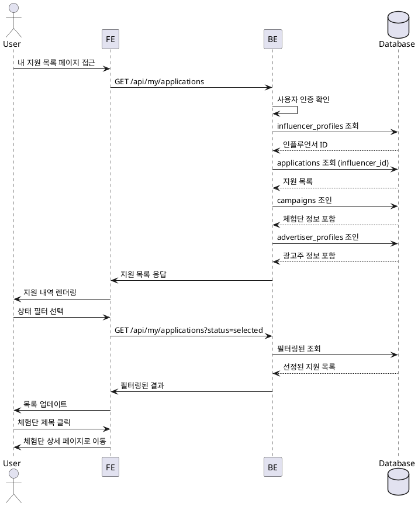

# 내 지원 목록 (인플루언서 전용)

## Primary Actor
인플루언서 역할 사용자

## Precondition
- 로그인 상태
- 인플루언서 프로필 등록 완료
- 1개 이상의 체험단 지원 이력 존재

## Trigger
마이페이지 또는 내비게이션에서 "내 지원 목록" 메뉴 클릭

## Main Scenario
1. 내 지원 목록 페이지 접근
2. 전체 지원 목록 확인
3. 상태 필터 선택 (전체/신청완료/선정/반려)
4. 지원한 체험단 정보 확인
5. 지원 상태별 태그 확인
6. 지원일시 및 방문예정일 확인
7. 체험단 제목 클릭하여 상세 이동

## Edge Cases
- **지원 내역 없음**: "아직 지원한 체험단이 없습니다" 안내
- **필터 결과 없음**: "해당 상태의 지원 내역이 없습니다" 표시
- **페이지네이션 오류**: 재시도 버튼 제공
- **삭제된 체험단**: "삭제된 체험단" 표시, 상세 이동 불가
- **데이터 동기화 지연**: 최신 상태 반영 새로고침 안내

## Business Rules
- 기본 정렬은 지원일시 최신순
- 한 페이지당 10개 지원 내역 표시
- 상태는 실시간 반영 (광고주 선정 시)
- 선정된 건은 하이라이트 표시
- 지원 취소는 불가능

## Sequence Diagram

