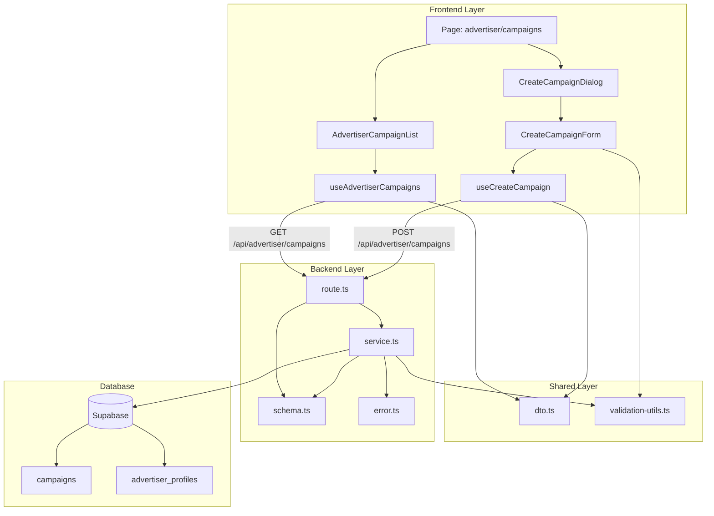

# 광고주 체험단 관리 - 구현 설계서

## 개요

광고주가 자신의 체험단을 조회하고 신규 체험단을 등록하는 기능을 구현합니다.

### 모듈 목록

| 모듈 | 위치 | 설명 |
|------|------|------|
| **Backend - Schema** | `src/features/campaign/backend/schema.ts` | 체험단 생성 요청/응답 스키마 추가 |
| **Backend - Error** | `src/features/campaign/backend/error.ts` | 광고주 관련 에러 코드 추가 |
| **Backend - Service** | `src/features/campaign/backend/service.ts` | 광고주 체험단 조회/생성 비즈니스 로직 |
| **Backend - Route** | `src/features/campaign/backend/route.ts` | 광고주 체험단 API 라우트 추가 |
| **Frontend - Hook** | `src/features/campaign/hooks/useAdvertiserCampaigns.ts` | 광고주 체험단 목록 조회 훅 |
| **Frontend - Hook** | `src/features/campaign/hooks/useCreateCampaign.ts` | 체험단 생성 mutation 훅 |
| **Frontend - Component** | `src/features/campaign/components/AdvertiserCampaignList.tsx` | 광고주 체험단 목록 컴포넌트 |
| **Frontend - Component** | `src/features/campaign/components/CreateCampaignDialog.tsx` | 체험단 등록 다이얼로그 |
| **Frontend - Component** | `src/features/campaign/components/CreateCampaignForm.tsx` | 체험단 등록 폼 |
| **Frontend - Page** | `src/app/advertiser/campaigns/page.tsx` | 광고주 체험단 관리 페이지 |
| **Shared - Validation** | `src/lib/validation-utils.ts` | 날짜 검증 함수 (기존 재사용) |
| **Shared - DTO** | `src/features/campaign/lib/dto.ts` | 스키마 타입 재노출 |

## Diagram



## Implementation Plan

### 1. Backend - Schema 확장

**파일**: `src/features/campaign/backend/schema.ts`

**추가 스키마**:

```typescript
// 체험단 생성 요청 스키마
export const CreateCampaignRequestSchema = z.object({
  title: z.string().min(5, '제목은 최소 5자 이상이어야 합니다').max(100, '제목은 최대 100자까지 입력 가능합니다'),
  recruitmentStart: z.string().refine(isFutureDate, {
    message: '모집 시작일은 오늘 이후여야 합니다',
  }),
  recruitmentEnd: z.string(),
  recruitmentCount: z.number().int().positive('모집 인원은 1명 이상이어야 합니다'),
  benefits: z.string().min(10, '제공 혜택은 최소 10자 이상이어야 합니다'),
  mission: z.string().min(10, '미션 내용은 최소 10자 이상이어야 합니다'),
  storeInfo: z.string().min(5, '매장 정보는 최소 5자 이상이어야 합니다'),
}).refine(
  (data) => isAfterDate(data.recruitmentEnd, data.recruitmentStart),
  {
    message: '모집 종료일은 시작일 이후여야 합니다',
    path: ['recruitmentEnd'],
  }
);

// 광고주 체험단 목록 응답 (CampaignListResponse 재사용 가능)
export const AdvertiserCampaignResponseSchema = CampaignResponseSchema.extend({
  applicantCount: z.number().int().nonnegative().optional().default(0),
});
```

**Unit Test Cases**:
- ✅ title이 5자 미만인 경우 실패
- ✅ title이 100자 초과인 경우 실패
- ✅ recruitmentStart가 과거 날짜인 경우 실패
- ✅ recruitmentEnd가 recruitmentStart보다 이전인 경우 실패
- ✅ recruitmentCount가 0 이하인 경우 실패
- ✅ benefits, mission, storeInfo가 최소 길이 미만인 경우 실패
- ✅ 유효한 데이터인 경우 성공

---

### 2. Backend - Error Code 추가

**파일**: `src/features/campaign/backend/error.ts`

**추가 에러 코드**:

```typescript
export const campaignErrorCodes = {
  // ... 기존 코드
  advertiserNotFound: 'ADVERTISER_NOT_FOUND',
  advertiserNotVerified: 'ADVERTISER_NOT_VERIFIED',
  invalidDateRange: 'INVALID_DATE_RANGE',
  createFailed: 'CAMPAIGN_CREATE_FAILED',
} as const;
```

---

### 3. Backend - Service 로직

**파일**: `src/features/campaign/backend/service.ts`

**추가 함수**:

```typescript
/**
 * 광고주가 등록한 체험단 목록 조회
 */
export const getAdvertiserCampaigns = async (
  client: SupabaseClient,
  userId: string,
  filters: Pick<CampaignListQuery, 'status' | 'sort' | 'page' | 'limit'>
): Promise<HandlerResult<CampaignListResponse, CampaignServiceError, unknown>>

/**
 * 체험단 생성
 */
export const createCampaign = async (
  client: SupabaseClient,
  userId: string,
  request: CreateCampaignRequest
): Promise<HandlerResult<CampaignResponse, CampaignServiceError, unknown>>
```

**비즈니스 로직**:

1. **getAdvertiserCampaigns**:
   - userId로 advertiser_profiles에서 광고주 프로필 조회
   - 광고주 프로필이 없으면 `ADVERTISER_NOT_FOUND` 에러
   - 광고주 프로필의 `is_verified`가 false면 `ADVERTISER_NOT_VERIFIED` 에러
   - advertiser_id로 campaigns 테이블 필터링
   - status, sort, pagination 적용
   - 응답 데이터 매핑 후 반환

2. **createCampaign**:
   - userId로 advertiser_profiles에서 광고주 프로필 조회 및 검증
   - 날짜 유효성 검증 (시작일 > 오늘, 종료일 > 시작일)
   - campaigns 테이블에 INSERT (status='recruiting')
   - 생성된 체험단 정보 반환 (201 Created)

**Unit Test Cases**:

**getAdvertiserCampaigns**:
- ✅ 광고주 프로필이 없는 경우 404 ADVERTISER_NOT_FOUND
- ✅ 광고주가 미인증 상태인 경우 403 ADVERTISER_NOT_VERIFIED
- ✅ 정상적으로 체험단 목록을 반환하는 경우
- ✅ status 필터링이 정상 작동하는 경우
- ✅ pagination이 정상 작동하는 경우

**createCampaign**:
- ✅ 광고주 프로필이 없는 경우 404 ADVERTISER_NOT_FOUND
- ✅ 광고주가 미인증 상태인 경우 403 ADVERTISER_NOT_VERIFIED
- ✅ 시작일이 과거인 경우 400 INVALID_DATE_RANGE
- ✅ 종료일이 시작일보다 이전인 경우 400 INVALID_DATE_RANGE
- ✅ DB 삽입 실패 시 500 CREATE_FAILED
- ✅ 정상적으로 체험단을 생성하고 201 반환

---

### 4. Backend - Route 추가

**파일**: `src/features/campaign/backend/route.ts`

**추가 라우트**:

```typescript
// GET /api/advertiser/campaigns
// - 인증된 광고주만 접근 가능
// - query: status, sort, page, limit
// - 응답: CampaignListResponse

// POST /api/advertiser/campaigns
// - 인증된 광고주만 접근 가능
// - body: CreateCampaignRequest
// - 응답: CampaignResponse (201 Created)
```

**구현 세부사항**:
- `createServerClient`로 사용자 인증 확인 (advertiser 라우트와 동일한 패턴)
- 미인증 사용자는 401 반환
- schema validation 후 service 함수 호출
- 에러 처리 및 로깅

---

### 5. Frontend - Hook: useAdvertiserCampaigns

**파일**: `src/features/campaign/hooks/useAdvertiserCampaigns.ts`

**구현**:

```typescript
import { useQuery } from '@tanstack/react-query';
import { apiClient } from '@/lib/remote/api-client';

export const useAdvertiserCampaigns = (params: {
  status?: 'recruiting' | 'closed' | 'selected';
  sort?: 'latest' | 'deadline';
  page?: number;
  limit?: number;
}) => {
  return useQuery({
    queryKey: ['advertiser', 'campaigns', params],
    queryFn: async () => {
      const response = await apiClient.get('/advertiser/campaigns', { params });
      return response.data;
    },
  });
};
```

---

### 6. Frontend - Hook: useCreateCampaign

**파일**: `src/features/campaign/hooks/useCreateCampaign.ts`

**구현**:

```typescript
import { useMutation, useQueryClient } from '@tanstack/react-query';
import { apiClient } from '@/lib/remote/api-client';

export const useCreateCampaign = () => {
  const queryClient = useQueryClient();

  return useMutation({
    mutationFn: async (data: CreateCampaignRequest) => {
      const response = await apiClient.post('/advertiser/campaigns', data);
      return response.data;
    },
    onSuccess: () => {
      queryClient.invalidateQueries({ queryKey: ['advertiser', 'campaigns'] });
    },
  });
};
```

---

### 7. Frontend - Component: AdvertiserCampaignList

**파일**: `src/features/campaign/components/AdvertiserCampaignList.tsx`

**책임**:
- `useAdvertiserCampaigns` 훅으로 데이터 조회
- 로딩/에러/빈 상태 처리
- 체험단 목록을 카드 형태로 렌더링
- 페이지네이션 UI 제공

**QA Sheet**:

| 시나리오 | 기대 결과 |
|---------|----------|
| 로딩 중 | 스켈레톤 UI 표시 |
| 에러 발생 | 에러 메시지 표시 및 재시도 버튼 |
| 데이터 없음 | "등록된 체험단이 없습니다" 메시지 |
| 데이터 있음 | 체험단 카드 목록 표시 |
| 페이지 변경 | 새 데이터 로드 및 렌더링 |
| 필터 변경 (status) | 필터링된 결과 표시 |

---

### 8. Frontend - Component: CreateCampaignDialog

**파일**: `src/features/campaign/components/CreateCampaignDialog.tsx`

**책임**:
- Dialog UI 제공 (shadcn-ui Dialog 사용)
- open/onOpenChange props로 상태 관리
- CreateCampaignForm 컴포넌트 포함

**QA Sheet**:

| 시나리오 | 기대 결과 |
|---------|----------|
| 다이얼로그 열림 | 폼이 초기 상태로 표시됨 |
| ESC 키 누름 | 다이얼로그 닫힘 |
| 배경 클릭 | 다이얼로그 닫힘 |
| 등록 완료 | 다이얼로그 자동 닫힘 |

---

### 9. Frontend - Component: CreateCampaignForm

**파일**: `src/features/campaign/components/CreateCampaignForm.tsx`

**책임**:
- react-hook-form + zod 기반 폼 관리
- 각 입력 필드 렌더링 (title, recruitmentStart, recruitmentEnd, recruitmentCount, benefits, mission, storeInfo)
- `useCreateCampaign` 훅으로 mutation 실행
- 유효성 검사 에러 표시

**QA Sheet**:

| 시나리오 | 기대 결과 |
|---------|----------|
| 필수 입력 누락 | 필드 하단에 에러 메시지 표시 |
| 제목 5자 미만 | "제목은 최소 5자 이상이어야 합니다" |
| 시작일이 과거 | "모집 시작일은 오늘 이후여야 합니다" |
| 종료일 < 시작일 | "모집 종료일은 시작일 이후여야 합니다" |
| 모집 인원 0 | "모집 인원은 1명 이상이어야 합니다" |
| 등록 버튼 클릭 (유효) | 로딩 스피너 표시 → 성공 토스트 → 폼 초기화 |
| 서버 오류 | 에러 토스트 표시, 입력값 유지 |
| 등록 진행 중 | 버튼 비활성화 |

---

### 10. Frontend - Page

**파일**: `src/app/advertiser/campaigns/page.tsx`

**책임**:
- 광고주 체험단 관리 페이지 레이아웃
- 헤더: 페이지 제목 + "신규 등록" 버튼
- AdvertiserCampaignList 컴포넌트 렌더링
- CreateCampaignDialog 상태 관리

**QA Sheet**:

| 시나리오 | 기대 결과 |
|---------|----------|
| 페이지 접근 (미인증) | 로그인 페이지로 리다이렉트 |
| 페이지 접근 (인증됨, 광고주) | 체험단 목록 표시 |
| "신규 등록" 버튼 클릭 | 등록 다이얼로그 열림 |
| 체험단 등록 완료 | 목록 자동 새로고침 |

---

### 11. Shared - Validation Utils (재사용)

**파일**: `src/lib/validation-utils.ts`

**사용 함수**:
- `isFutureDate(dateString)`: 오늘 이후 날짜인지 검증
- `isAfterDate(target, reference)`: target이 reference보다 이후인지 검증

**변경사항**: 없음 (기존 함수 재사용)

---

### 12. Shared - DTO

**파일**: `src/features/campaign/lib/dto.ts`

**추가 export**:

```typescript
export {
  CreateCampaignRequestSchema,
  AdvertiserCampaignResponseSchema,
  type CreateCampaignRequest,
  type AdvertiserCampaignResponse,
} from '../backend/schema';
```

---

## 구현 순서

1. **Backend Schema 확장** (`schema.ts`)
2. **Backend Error Code 추가** (`error.ts`)
3. **Backend Service 구현** (`service.ts`)
4. **Backend Route 추가** (`route.ts`)
5. **Frontend DTO 재노출** (`dto.ts`)
6. **Frontend Hook 구현** (`useAdvertiserCampaigns.ts`, `useCreateCampaign.ts`)
7. **Frontend Form 컴포넌트** (`CreateCampaignForm.tsx`)
8. **Frontend Dialog 컴포넌트** (`CreateCampaignDialog.tsx`)
9. **Frontend List 컴포넌트** (`AdvertiserCampaignList.tsx`)
10. **Frontend Page** (`page.tsx`)

---

## 추가 고려사항

### 인증/권한 검증
- 모든 API는 인증된 광고주만 접근 가능
- `advertiser_profiles.is_verified = true` 인 경우에만 체험단 등록 가능

### 에러 처리
- 네트워크 에러: 재시도 버튼 제공
- 검증 에러: 필드별 에러 메시지 표시
- 서버 에러: 토스트 알림

### UX 개선
- 폼 입력 중 자동 저장 (localStorage)
- 등록 완료 후 목록 자동 업데이트
- 로딩 스피너 및 스켈레톤 UI

### 테스트
- Backend: Unit test (service 함수, schema 검증)
- Frontend: QA Sheet 기반 수동 테스트
