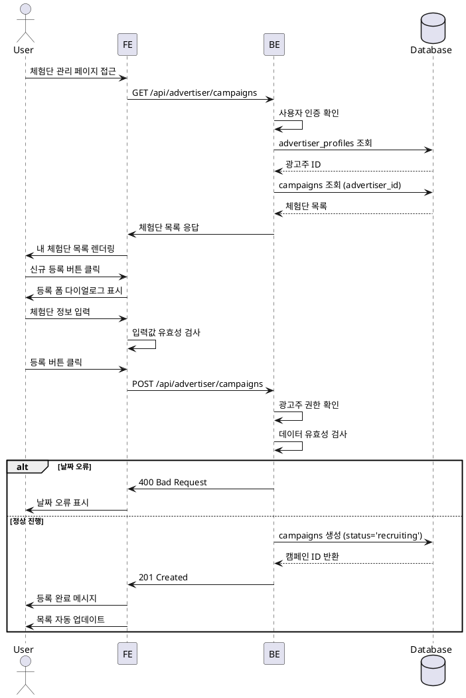

# 광고주 체험단 관리

## Primary Actor
광고주 역할 사용자

## Precondition
- 로그인 상태
- 광고주 프로필 등록 완료
- 사업자번호 검증 완료

## Trigger
마이페이지 또는 내비게이션에서 "체험단 관리" 메뉴 클릭

## Main Scenario
1. 체험단 관리 페이지 접근
2. 내가 등록한 체험단 목록 확인
3. 신규 체험단 등록 버튼 클릭
4. 등록 폼 다이얼로그 표시
5. 체험단 정보 입력 (제목, 기간, 인원, 혜택, 미션, 매장정보)
6. 입력 내용 검토
7. 등록 버튼 클릭
8. 등록 완료 및 목록 업데이트

## Edge Cases
- **필수 입력 누락**: 필수 필드 강조 및 안내
- **잘못된 날짜**: "종료일은 시작일 이후여야 합니다" 오류
- **과거 날짜**: "시작일은 오늘 이후여야 합니다" 오류
- **동시 등록 제한**: "한 번에 하나의 체험단만 등록 가능" 안내
- **서버 오류**: 재시도 버튼 제공, 입력값 유지

## Business Rules
- 모집 시작일은 오늘 이후만 가능
- 모집 종료일은 시작일 이후만 가능
- 모집 인원은 1명 이상
- 체험단 수정은 모집 시작 전까지만 가능
- 삭제는 지원자가 없을 때만 가능

## Sequence Diagram

