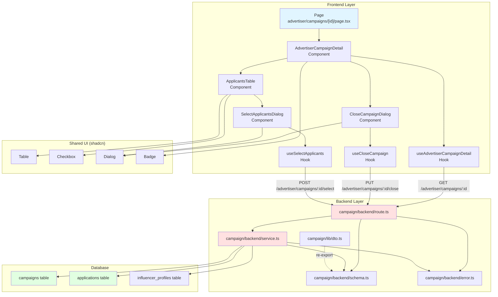

# 광고주 체험단 상세 & 모집 관리 - 구현 설계

## 개요

### 1. Backend Modules

| 모듈 | 위치 | 설명 |
|------|------|------|
| **Route Handlers** | `src/features/campaign/backend/route.ts` | 광고주 체험단 관리 API 엔드포인트 추가 |
| **Service Layer** | `src/features/campaign/backend/service.ts` | 체험단 상세 조회, 모집종료, 선정 비즈니스 로직 |
| **Request/Response Schema** | `src/features/campaign/backend/schema.ts` | 지원자 목록, 선정 요청/응답 스키마 정의 |
| **Error Codes** | `src/features/campaign/backend/error.ts` | 모집종료/선정 관련 에러 코드 추가 |
| **DTO Exports** | `src/features/campaign/lib/dto.ts` | 프론트엔드용 스키마 재노출 |

### 2. Frontend Modules

| 모듈 | 위치 | 설명 |
|------|------|------|
| **Page** | `src/app/advertiser/campaigns/[id]/page.tsx` | 광고주 체험단 상세 관리 페이지 |
| **Detail Component** | `src/features/campaign/components/AdvertiserCampaignDetail.tsx` | 체험단 정보 및 상태 표시 |
| **Applicants Table** | `src/features/campaign/components/ApplicantsTable.tsx` | 지원자 목록 테이블 (체크박스, 정렬) |
| **Close Dialog** | `src/features/campaign/components/CloseCampaignDialog.tsx` | 모집종료 확인 다이얼로그 |
| **Select Dialog** | `src/features/campaign/components/SelectApplicantsDialog.tsx` | 선정 확인 다이얼로그 |
| **Detail Hook** | `src/features/campaign/hooks/useAdvertiserCampaignDetail.ts` | 체험단 상세 조회 React Query |
| **Close Hook** | `src/features/campaign/hooks/useCloseCampaign.ts` | 모집종료 Mutation |
| **Select Hook** | `src/features/campaign/hooks/useSelectApplicants.ts` | 지원자 선정 Mutation |

### 3. Shared Components (재사용 가능)

| 모듈 | 위치 | 설명 |
|------|------|------|
| **Table Component** | `src/components/ui/table.tsx` | shadcn/ui Table (이미 존재 가능) |
| **Checkbox Component** | `src/components/ui/checkbox.tsx` | shadcn/ui Checkbox (이미 존재 가능) |
| **Dialog Component** | `src/components/ui/dialog.tsx` | shadcn/ui Dialog (이미 존재) |
| **Status Badge** | `src/components/ui/badge.tsx` | shadcn/ui Badge (이미 존재 가능) |

---

## Diagram



---

## Implementation Plan

### 1. Backend API Layer

#### 1.1 Error Codes (`error.ts`)

**추가할 에러 코드:**
```typescript
export const campaignErrorCodes = {
  // ... existing codes
  closeFailed: 'CAMPAIGN_CLOSE_FAILED',
  alreadyClosed: 'CAMPAIGN_ALREADY_CLOSED',
  selectFailed: 'CAMPAIGN_SELECT_FAILED',
  alreadySelected: 'CAMPAIGN_ALREADY_SELECTED',
  notClosedYet: 'CAMPAIGN_NOT_CLOSED_YET',
  invalidSelection: 'INVALID_APPLICANT_SELECTION',
  unauthorizedAccess: 'UNAUTHORIZED_CAMPAIGN_ACCESS',
} as const;
```

**Unit Tests:**
- ✅ 모든 에러 코드가 unique string인지 확인
- ✅ 타입 추론 테스트 (`CampaignServiceError` 타입 검증)

---

#### 1.2 Schema Definitions (`schema.ts`)

**추가할 스키마:**

```typescript
// 지원자 정보 응답
export const ApplicantResponseSchema = z.object({
  id: z.string().uuid(),
  influencerId: z.string().uuid(),
  influencerName: z.string(),
  message: z.string(),
  visitDate: z.string(),
  status: z.enum(['applied', 'selected', 'rejected']),
  createdAt: z.string(),
  channels: z.array(z.object({
    channelType: z.string(),
    channelName: z.string(),
    followerCount: z.number().int().nonnegative(),
  })),
});

// 광고주 체험단 상세 응답 (기존 CampaignDetailResponse 확장)
export const AdvertiserCampaignDetailResponseSchema = z.object({
  id: z.string().uuid(),
  title: z.string(),
  recruitmentStart: z.string(),
  recruitmentEnd: z.string(),
  recruitmentCount: z.number().int().positive(),
  benefits: z.string(),
  mission: z.string(),
  storeInfo: z.string(),
  status: CampaignStatusSchema,
  category: z.string(),
  companyName: z.string(),
  location: z.string(),
  createdAt: z.string(),
  daysRemaining: z.number().int().optional(),
  isDeadlineSoon: z.boolean(),
  applicants: z.array(ApplicantResponseSchema),
  applicantCount: z.number().int().nonnegative(),
});

// 선정 요청
export const SelectApplicantsRequestSchema = z.object({
  selectedIds: z.array(z.string().uuid()).min(1, '최소 1명 이상 선택해야 합니다'),
});

// 선정 응답
export const SelectApplicantsResponseSchema = z.object({
  selectedCount: z.number().int().positive(),
  rejectedCount: z.number().int().nonnegative(),
});
```

**Unit Tests:**
- ✅ ApplicantResponseSchema 유효/무효 데이터 검증
- ✅ AdvertiserCampaignDetailResponseSchema 필수 필드 검증
- ✅ SelectApplicantsRequestSchema 빈 배열 거부 확인
- ✅ SelectApplicantsResponseSchema 음수 거부 확인

---

#### 1.3 Service Layer (`service.ts`)

**추가할 함수:**

##### `getAdvertiserCampaignDetail`
```typescript
export const getAdvertiserCampaignDetail = async (
  client: SupabaseClient,
  userId: string,
  campaignId: string
): Promise<
  HandlerResult<AdvertiserCampaignDetailResponse, CampaignServiceError, unknown>
>
```

**비즈니스 로직:**
1. 광고주 프로필 조회 및 검증 (user_id → advertiser_id)
2. campaigns 테이블에서 campaignId + advertiser_id 조회
3. 권한 없으면 `unauthorizedAccess` 에러
4. applications 조회 (campaign_id 기준)
5. influencer_profiles + influencer_channels 조인
6. 응답 매핑 후 반환

**Unit Tests:**
- ✅ 정상 조회 시 지원자 목록 포함 확인
- ✅ 광고주 프로필 없을 때 `advertiserNotFound` 반환
- ✅ 광고주 인증 안됐을 때 `advertiserNotVerified` 반환
- ✅ 다른 광고주의 체험단 조회 시 `unauthorizedAccess` 반환
- ✅ 지원자 없을 때 빈 배열 반환
- ✅ 체험단 없을 때 `notFound` 반환

---

##### `closeCampaign`
```typescript
export const closeCampaign = async (
  client: SupabaseClient,
  userId: string,
  campaignId: string
): Promise<
  HandlerResult<{ status: 'closed' }, CampaignServiceError, unknown>
>
```

**비즈니스 로직:**
1. 광고주 프로필 조회 및 검증
2. campaigns 테이블에서 campaignId + advertiser_id 조회
3. 권한 검증
4. 현재 status가 'recruiting'인지 확인
5. 이미 'closed' 또는 'selected'면 `alreadyClosed` 에러
6. status를 'closed'로 업데이트
7. 성공 응답 반환

**Unit Tests:**
- ✅ 정상 모집종료 시 status='closed' 반환
- ✅ 이미 closed일 때 `alreadyClosed` 에러
- ✅ 이미 selected일 때 `alreadyClosed` 에러
- ✅ 권한 없을 때 `unauthorizedAccess` 에러
- ✅ 체험단 없을 때 `notFound` 에러
- ✅ 광고주 미인증 시 `advertiserNotVerified` 에러

---

##### `selectApplicants`
```typescript
export const selectApplicants = async (
  client: SupabaseClient,
  userId: string,
  campaignId: string,
  request: SelectApplicantsRequest
): Promise<
  HandlerResult<SelectApplicantsResponse, CampaignServiceError, unknown>
>
```

**비즈니스 로직:**
1. 광고주 프로필 조회 및 검증
2. campaigns 테이블에서 campaignId + advertiser_id 조회
3. 권한 검증
4. 현재 status가 'closed'인지 확인 (아니면 `notClosedYet` 에러)
5. 이미 'selected'면 `alreadySelected` 에러
6. selectedIds 존재 여부 확인 (없으면 `invalidSelection`)
7. **Transaction 시작**
   - campaigns.status → 'selected'
   - applications 중 selectedIds에 포함된 것 → status='selected'
   - applications 중 selectedIds에 미포함된 것 → status='rejected'
8. **Transaction 종료**
9. selectedCount, rejectedCount 계산 후 반환

**Unit Tests:**
- ✅ 정상 선정 시 selectedCount, rejectedCount 정확성
- ✅ status='recruiting'일 때 `notClosedYet` 에러
- ✅ status='selected'일 때 `alreadySelected` 에러
- ✅ selectedIds 중 존재하지 않는 ID 포함 시 `invalidSelection` 에러
- ✅ 권한 없을 때 `unauthorizedAccess` 에러
- ✅ 광고주 미인증 시 `advertiserNotVerified` 에러
- ✅ Transaction rollback 테스트 (일부 실패 시 전체 롤백)

---

#### 1.4 Route Handlers (`route.ts`)

**추가할 엔드포인트:**

##### `GET /advertiser/campaigns/:id`
- authSupabase로 user 획득
- user 없으면 401
- `getAdvertiserCampaignDetail` 호출
- respond() 반환

##### `PUT /advertiser/campaigns/:id/close`
- authSupabase로 user 획득
- user 없으면 401
- `closeCampaign` 호출
- respond() 반환

##### `POST /advertiser/campaigns/:id/select`
- authSupabase로 user 획득
- user 없으면 401
- request body 파싱 (SelectApplicantsRequestSchema)
- validation 실패 시 400
- `selectApplicants` 호출
- respond() 반환

**Integration Tests (E2E):**
- ✅ GET 정상 응답 200 + applicants 배열 확인
- ✅ PUT 정상 응답 200 + status='closed' 확인
- ✅ POST 정상 응답 200 + selectedCount/rejectedCount 확인
- ✅ 비로그인 시 401 응답
- ✅ 다른 광고주 접근 시 403/404 응답
- ✅ 잘못된 요청 시 400 응답

---

#### 1.5 DTO Export (`lib/dto.ts`)

**추가할 export:**
```typescript
export {
  ApplicantResponseSchema,
  AdvertiserCampaignDetailResponseSchema,
  SelectApplicantsRequestSchema,
  SelectApplicantsResponseSchema,
  type ApplicantResponse,
  type AdvertiserCampaignDetailResponse,
  type SelectApplicantsRequest,
  type SelectApplicantsResponse,
} from '../backend/schema';
```

---

### 2. Frontend UI Layer

#### 2.1 Hooks

##### `useAdvertiserCampaignDetail.ts`
```typescript
export const useAdvertiserCampaignDetail = (campaignId: string) => {
  return useQuery({
    queryKey: ['advertiserCampaignDetail', campaignId],
    queryFn: async () => {
      const response = await apiClient.get(
        `/advertiser/campaigns/${campaignId}`
      );
      return AdvertiserCampaignDetailResponseSchema.parse(response.data);
    },
  });
};
```

**QA Sheet:**
- ✅ 로그인 상태에서 정상 데이터 로드
- ✅ 비로그인 시 401 에러 핸들링
- ✅ 다른 광고주 체험단 접근 시 에러 표시
- ✅ 네트워크 에러 시 재시도 가능
- ✅ 로딩 상태 표시 확인

---

##### `useCloseCampaign.ts`
```typescript
export const useCloseCampaign = () => {
  const queryClient = useQueryClient();

  return useMutation({
    mutationFn: async (campaignId: string) => {
      const response = await apiClient.put(
        `/advertiser/campaigns/${campaignId}/close`
      );
      return response.data;
    },
    onSuccess: (_, campaignId) => {
      queryClient.invalidateQueries(['advertiserCampaignDetail', campaignId]);
      queryClient.invalidateQueries(['advertiserCampaigns']);
    },
  });
};
```

**QA Sheet:**
- ✅ 모집종료 성공 시 목록/상세 페이지 자동 갱신
- ✅ 이미 종료된 체험단 모집종료 시도 시 에러 메시지 표시
- ✅ 네트워크 에러 시 에러 메시지 표시
- ✅ 로딩 상태 동안 버튼 비활성화

---

##### `useSelectApplicants.ts`
```typescript
export const useSelectApplicants = () => {
  const queryClient = useQueryClient();

  return useMutation({
    mutationFn: async ({
      campaignId,
      selectedIds,
    }: {
      campaignId: string;
      selectedIds: string[];
    }) => {
      const response = await apiClient.post(
        `/advertiser/campaigns/${campaignId}/select`,
        { selectedIds }
      );
      return SelectApplicantsResponseSchema.parse(response.data);
    },
    onSuccess: (_, { campaignId }) => {
      queryClient.invalidateQueries(['advertiserCampaignDetail', campaignId]);
      queryClient.invalidateQueries(['advertiserCampaigns']);
    },
  });
};
```

**QA Sheet:**
- ✅ 선정 성공 시 목록/상세 페이지 자동 갱신
- ✅ 0명 선택 시 에러 메시지 표시
- ✅ 모집중 상태에서 선정 시도 시 에러 메시지 표시
- ✅ 이미 선정 완료된 체험단 재선정 시 에러 메시지 표시
- ✅ 선정 완료 후 Toast 알림 표시

---

#### 2.2 Components

##### `AdvertiserCampaignDetail.tsx`
**Props:**
```typescript
type Props = {
  campaignId: string;
};
```

**기능:**
- `useAdvertiserCampaignDetail` 호출
- 로딩/에러 상태 처리
- 체험단 기본 정보 표시 (제목, 모집기간, 혜택, 미션, 매장정보)
- status에 따라 Badge 색상 변경 (recruiting=green, closed=yellow, selected=blue)
- status='recruiting'일 때만 "모집종료" 버튼 표시
- "모집종료" 버튼 클릭 시 CloseCampaignDialog 열기
- ApplicantsTable 컴포넌트 렌더링

**QA Sheet:**
- ✅ status별 Badge 색상 정확성 (recruiting, closed, selected)
- ✅ recruiting 상태에서만 "모집종료" 버튼 표시
- ✅ closed/selected 상태에서 "모집종료" 버튼 미표시
- ✅ 로딩 중 Skeleton UI 표시
- ✅ 에러 발생 시 에러 메시지 표시
- ✅ 반응형 레이아웃 (모바일/데스크톱)

---

##### `ApplicantsTable.tsx`
**Props:**
```typescript
type Props = {
  applicants: ApplicantResponse[];
  campaignStatus: 'recruiting' | 'closed' | 'selected';
  campaignId: string;
  recruitmentCount: number;
};
```

**기능:**
- shadcn/ui Table 사용
- 컬럼: 체크박스, 이름, 채널정보, 방문예정일, 지원일, 상태
- status='selected'일 때 체크박스/선정 버튼 비활성화
- status='closed'일 때만 체크박스 활성화 + "선정 완료" 버튼 표시
- 지원자 없을 때 "아직 지원자가 없습니다" 표시
- "선정 완료" 버튼 클릭 시 SelectApplicantsDialog 열기
- 선정된 지원자는 체크박스 체크 불가 + 배경색 변경

**QA Sheet:**
- ✅ 지원자 없을 때 Empty State 표시
- ✅ recruiting 상태에서 체크박스/선정 버튼 비활성화
- ✅ closed 상태에서 체크박스/선정 버튼 활성화
- ✅ selected 상태에서 체크박스/선정 버튼 비활성화
- ✅ 선정 인원 초과 선택 시 경고 메시지
- ✅ 선정 인원 미달 선택 시 확인 요청
- ✅ 테이블 정렬 기능 (지원일 최신순/오래된순)
- ✅ 모바일에서 가로 스크롤 지원

---

##### `CloseCampaignDialog.tsx`
**Props:**
```typescript
type Props = {
  open: boolean;
  onOpenChange: (open: boolean) => void;
  campaignId: string;
  campaignTitle: string;
};
```

**기능:**
- shadcn/ui Dialog 사용
- "정말 모집을 종료하시겠습니까?" 확인 메시지
- "모집종료는 되돌릴 수 없습니다" 경고 문구
- "취소" / "모집종료" 버튼
- `useCloseCampaign` 호출
- 성공 시 Dialog 닫기 + Toast 알림

**QA Sheet:**
- ✅ "취소" 클릭 시 Dialog 닫기
- ✅ "모집종료" 클릭 시 API 호출 + 로딩 표시
- ✅ 성공 시 Toast 알림 + Dialog 자동 닫기
- ✅ 실패 시 에러 메시지 표시 + Dialog 유지
- ✅ ESC 키로 Dialog 닫기 가능

---

##### `SelectApplicantsDialog.tsx`
**Props:**
```typescript
type Props = {
  open: boolean;
  onOpenChange: (open: boolean) => void;
  campaignId: string;
  selectedIds: string[];
  recruitmentCount: number;
};
```

**기능:**
- shadcn/ui Dialog 사용
- 선정 인원과 실제 선택 인원 비교 표시
- 선정 인원 초과 시 "모집 인원을 초과했습니다" 경고
- 선정 인원 미달 시 "선정 인원이 부족합니다. 계속하시겠습니까?" 확인
- "취소" / "선정 완료" 버튼
- `useSelectApplicants` 호출
- 성공 시 Dialog 닫기 + Toast 알림 (선정 N명, 반려 M명)

**QA Sheet:**
- ✅ 선정 인원 초과 시 경고 메시지 + "선정 완료" 버튼 비활성화
- ✅ 선정 인원 미달 시 확인 메시지 표시 + 진행 가능
- ✅ 0명 선택 시 "최소 1명 선택" 에러 메시지
- ✅ 성공 시 Toast 알림 (예: "3명 선정, 2명 반려")
- ✅ 실패 시 에러 메시지 표시
- ✅ ESC 키로 Dialog 닫기 가능

---

#### 2.3 Page

##### `src/app/advertiser/campaigns/[id]/page.tsx`
```typescript
'use client';

export default async function Page({ params }: { params: Promise<{ id: string }> }) {
  const { id } = await params;

  return (
    <div className="container mx-auto py-8">
      <AdvertiserCampaignDetail campaignId={id} />
    </div>
  );
}
```

**QA Sheet:**
- ✅ URL 파라미터로 올바른 campaignId 전달
- ✅ 로그인 상태에서 정상 접근
- ✅ 비로그인 시 로그인 페이지로 리디렉션 (미들웨어/가드)
- ✅ 다른 광고주 체험단 접근 시 403/404 에러 표시
- ✅ 뒤로가기 시 목록 페이지로 이동

---

### 3. Shared UI Components

필요한 shadcn/ui 컴포넌트:
```bash
$ npx shadcn@latest add table
$ npx shadcn@latest add checkbox
$ npx shadcn@latest add dialog
$ npx shadcn@latest add badge
$ npx shadcn@latest add toast
```

---

## Test Coverage Summary

### Backend
- **Error Codes**: 타입 및 unique 검증
- **Schema**: 각 스키마별 유효/무효 데이터 테스트
- **Service**: 각 함수별 성공/실패 케이스 (총 20+ cases)
- **Route**: E2E 통합 테스트 (인증, 권한, 요청/응답 검증)

### Frontend
- **Hooks**: React Query 정상 동작, 에러 핸들링, invalidation
- **Components**: QA Sheet 기반 수동 테스트 (상태별 UI, 사용자 인터랙션)
- **Page**: 라우팅, 권한 가드, 파라미터 전달

---

## Implementation Checklist

- [ ] Backend: error.ts 에러 코드 추가
- [ ] Backend: schema.ts 스키마 정의
- [ ] Backend: service.ts 3개 함수 구현 + unit tests
- [ ] Backend: route.ts 3개 엔드포인트 추가 + E2E tests
- [ ] Backend: lib/dto.ts export 추가
- [ ] Frontend: 3개 hooks 구현
- [ ] Frontend: 5개 components 구현
- [ ] Frontend: page.tsx 작성
- [ ] UI: shadcn components 설치 (table, checkbox, dialog, badge, toast)
- [ ] QA: Frontend QA Sheet 기반 수동 테스트

---

## Notes

1. **Transaction 처리**: `selectApplicants`에서 campaigns.status 업데이트와 applications 다중 업데이트를 Supabase Transaction으로 묶어야 함.
2. **권한 검증**: 모든 광고주 API는 user_id → advertiser_id 변환 후 campaign.advertiser_id와 일치 여부 확인 필수.
3. **상태 전이**: recruiting → closed → selected 순서만 허용, 역방향 불가.
4. **에러 핸들링**: 프론트엔드에서 에러 코드별 사용자 친화적 메시지 표시.
5. **Toast 알림**: 모집종료/선정 성공 시 사용자 피드백 제공.
