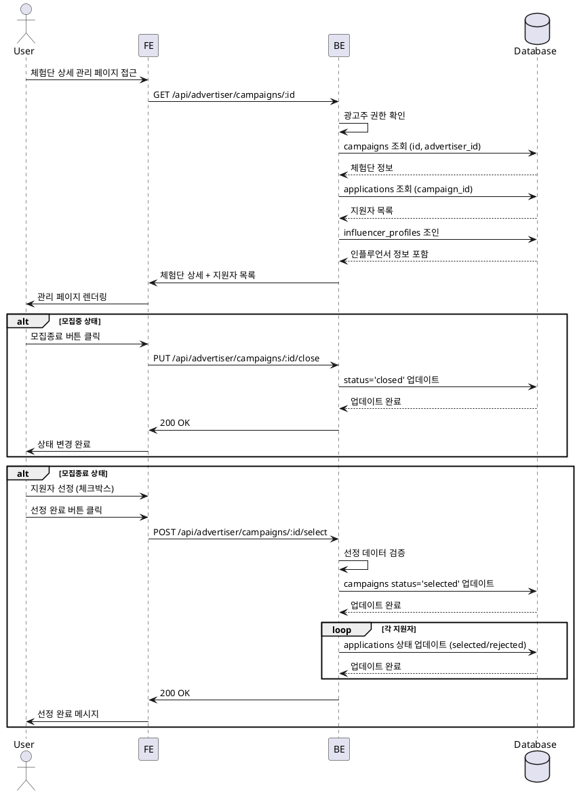

# 광고주 체험단 상세 & 모집 관리

## Primary Actor
광고주 역할 사용자

## Precondition
- 로그인 상태
- 광고주 프로필 등록 완료
- 1개 이상의 체험단 등록 완료

## Trigger
체험단 관리 목록에서 특정 체험단 클릭

## Main Scenario
1. 체험단 상세 관리 페이지 접근
2. 체험단 정보 및 지원 현황 확인
3. 지원자 목록 테이블 확인
4. 모집종료 버튼 클릭 (모집중인 경우)
5. 모집종료 확인 및 처리
6. 체험단 선정 버튼 클릭
7. 지원자 중 선정할 인플루언서 체크
8. 선정 완료 버튼 클릭
9. 선정 결과 저장 및 알림

## Edge Cases
- **지원자 없음**: "아직 지원자가 없습니다" 표시
- **이미 모집종료**: 모집종료 버튼 비활성화
- **이미 선정완료**: 선정 버튼 비활성화, 결과만 표시
- **선정 인원 초과**: "모집 인원을 초과했습니다" 경고
- **선정 인원 미달**: "선정 인원이 부족합니다" 확인 요청

## Business Rules
- 모집종료는 되돌릴 수 없음
- 선정은 모집종료 후에만 가능
- 선정 완료 후 변경 불가
- 선정/반려 시 인플루언서에게 상태 반영
- 모집 인원과 선정 인원이 다를 수 있음

## Sequence Diagram

