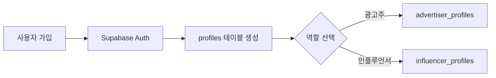
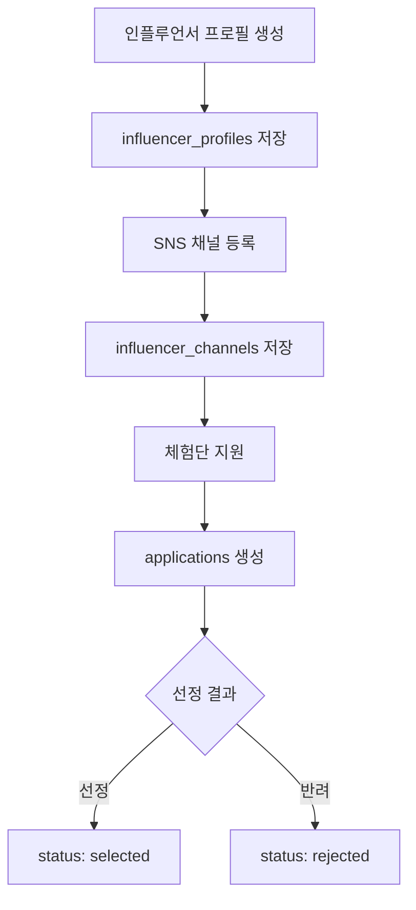
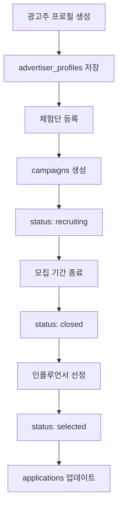
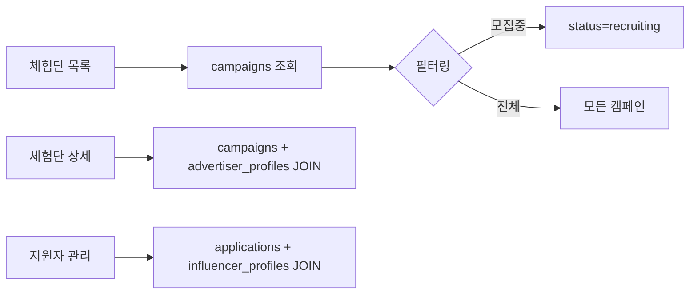

# 데이터베이스 설계 문서

## 개요

SuperNext 플랫폼의 데이터베이스 설계 문서입니다. PostgreSQL(Supabase)을 기반으로 설계되었으며, 광고주와 인플루언서를 연결하는 체험단 플랫폼의 핵심 데이터 구조를 정의합니다.

## 데이터 플로우

### 1. 사용자 인증 플로우


**상세 프로세스:**
- 사용자가 가입하면 Supabase Auth를 통해 인증 정보 생성
- `profiles` 테이블에 기본 사용자 정보 저장 (이름, 전화번호, 이메일, 생년월일, 역할)
- 선택한 역할에 따라 `advertiser_profiles` 또는 `influencer_profiles`에 추가 정보 저장

### 2. 인플루언서 데이터 플로우


**상세 프로세스:**
- 인플루언서 추가 정보 입력 → `influencer_profiles` 저장
- SNS 채널 정보 등록 (네이버, 유튜브, 인스타그램, 스레드) 및 팔로워수 → `influencer_channels` 저장
- 체험단 지원 시 지원 정보 → `applications` 레코드 생성 (status: applied)
- 광고주 선정 결과에 따라 → `applications` 상태 업데이트 (selected/rejected)

### 3. 광고주 데이터 플로우


**상세 프로세스:**
- 광고주 정보 입력 (업체명, 주소, 위치, 업장 전화번호, 카테고리, 사업자번호, 대표자명) → `advertiser_profiles` 저장
- 체험단 캠페인 생성 → `campaigns` 레코드 생성 (status: recruiting)
- 모집 기간 종료 → `campaigns` 상태 변경 (recruiting → closed)
- 인플루언서 선정 완료 → `campaigns` 상태 변경 (closed → selected)
- 선정/반려 결과 → 관련 `applications` 상태 업데이트

### 4. 체험단 운영 플로우


**상세 프로세스:**
- 체험단 목록 조회: `campaigns` 테이블에서 status 필터링
- 체험단 상세 조회: `campaigns`와 `advertiser_profiles` 조인하여 광고주 정보 포함
- 지원자 목록 조회: `applications`와 `influencer_profiles` 조인하여 인플루언서 정보 포함

## 데이터베이스 스키마

### 테이블 구조

#### 1. profiles (사용자 기본 정보)
| 컬럼명 | 타입 | 제약조건 | 설명 |
|--------|------|----------|------|
| id | UUID | PK, FK(auth.users) | 사용자 고유 ID |
| name | VARCHAR(100) | NOT NULL | 사용자 이름 |
| phone | VARCHAR(20) | NOT NULL | 전화번호 |
| email | VARCHAR(255) | NOT NULL, UNIQUE | 이메일 |
| birth_date | DATE | NOT NULL | 생년월일 |
| role | VARCHAR(20) | NOT NULL, CHECK | 역할 (advertiser/influencer) |
| terms_agreed_at | TIMESTAMP | NOT NULL | 약관 동의 시간 |
| created_at | TIMESTAMP | DEFAULT NOW() | 생성 시간 |
| updated_at | TIMESTAMP | DEFAULT NOW() | 수정 시간 |

#### 2. influencer_profiles (인플루언서 프로필)
| 컬럼명 | 타입 | 제약조건 | 설명 |
|--------|------|----------|------|
| id | UUID | PK | 인플루언서 프로필 ID |
| user_id | UUID | FK(profiles), UNIQUE | 사용자 ID |
| is_verified | BOOLEAN | DEFAULT FALSE | 인증 여부 |
| created_at | TIMESTAMP | DEFAULT NOW() | 생성 시간 |
| updated_at | TIMESTAMP | DEFAULT NOW() | 수정 시간 |

#### 3. influencer_channels (인플루언서 SNS 채널)
| 컬럼명 | 타입 | 제약조건 | 설명 |
|--------|------|----------|------|
| id | UUID | PK | 채널 ID |
| influencer_id | UUID | FK(influencer_profiles) | 인플루언서 ID |
| channel_type | VARCHAR(20) | NOT NULL, CHECK | 채널 유형 (naver/youtube/instagram/threads) |
| channel_name | VARCHAR(100) | NOT NULL | 채널명 |
| channel_url | VARCHAR(500) | NOT NULL | 채널 URL |
| follower_count | INTEGER | DEFAULT 0 | 팔로워수 |
| verification_status | VARCHAR(20) | DEFAULT 'pending' | 인증 상태 (pending/verified/failed) |
| created_at | TIMESTAMP | DEFAULT NOW() | 생성 시간 |
| updated_at | TIMESTAMP | DEFAULT NOW() | 수정 시간 |

**제약조건:** UNIQUE(influencer_id, channel_type, channel_url) - 중복 채널 방지

#### 4. advertiser_profiles (광고주 프로필)
| 컬럼명 | 타입 | 제약조건 | 설명 |
|--------|------|----------|------|
| id | UUID | PK | 광고주 프로필 ID |
| user_id | UUID | FK(profiles), UNIQUE | 사용자 ID |
| company_name | VARCHAR(200) | NOT NULL | 업체명 |
| address | VARCHAR(500) | NOT NULL | 주소 |
| location | VARCHAR(500) | NOT NULL | 위치 |
| store_phone | VARCHAR(20) | NOT NULL | 업장 전화번호 |
| category | VARCHAR(100) | NOT NULL | 카테고리 |
| business_number | VARCHAR(50) | NOT NULL, UNIQUE | 사업자번호 |
| representative_name | VARCHAR(100) | NOT NULL | 대표자명 |
| is_verified | BOOLEAN | DEFAULT FALSE | 인증 여부 |
| created_at | TIMESTAMP | DEFAULT NOW() | 생성 시간 |
| updated_at | TIMESTAMP | DEFAULT NOW() | 수정 시간 |

#### 5. campaigns (체험단 캠페인)
| 컬럼명 | 타입 | 제약조건 | 설명 |
|--------|------|----------|------|
| id | UUID | PK | 캠페인 ID |
| advertiser_id | UUID | FK(advertiser_profiles) | 광고주 ID |
| title | VARCHAR(200) | NOT NULL | 체험단 제목 |
| recruitment_start | DATE | NOT NULL | 모집 시작일 |
| recruitment_end | DATE | NOT NULL | 모집 종료일 |
| recruitment_count | INTEGER | NOT NULL, CHECK(>0) | 모집 인원 |
| benefits | TEXT | NOT NULL | 혜택 내용 |
| mission | TEXT | NOT NULL | 미션 내용 |
| store_info | TEXT | NOT NULL | 매장 정보 |
| status | VARCHAR(20) | DEFAULT 'recruiting' | 상태 (recruiting/closed/selected) |
| created_at | TIMESTAMP | DEFAULT NOW() | 생성 시간 |
| updated_at | TIMESTAMP | DEFAULT NOW() | 수정 시간 |

#### 6. applications (체험단 지원)
| 컬럼명 | 타입 | 제약조건 | 설명 |
|--------|------|----------|------|
| id | UUID | PK | 지원 ID |
| campaign_id | UUID | FK(campaigns) | 캠페인 ID |
| influencer_id | UUID | FK(influencer_profiles) | 인플루언서 ID |
| message | TEXT | NOT NULL | 각오 한마디 |
| visit_date | DATE | NOT NULL | 방문 예정일자 |
| status | VARCHAR(20) | DEFAULT 'applied' | 상태 (applied/selected/rejected) |
| created_at | TIMESTAMP | DEFAULT NOW() | 생성 시간 |
| updated_at | TIMESTAMP | DEFAULT NOW() | 수정 시간 |

**제약조건:** UNIQUE(campaign_id, influencer_id) - 중복 지원 방지

### 인덱스 설계

성능 최적화를 위한 인덱스:

```sql
-- 캠페인 조회 최적화
CREATE INDEX idx_campaigns_status ON campaigns(status);
CREATE INDEX idx_campaigns_recruitment_dates ON campaigns(recruitment_start, recruitment_end);

-- 지원 관련 조회 최적화
CREATE INDEX idx_applications_campaign_id ON applications(campaign_id);
CREATE INDEX idx_applications_influencer_id ON applications(influencer_id);
CREATE INDEX idx_applications_status ON applications(status);
```

### 트리거

모든 테이블의 `updated_at` 컬럼 자동 업데이트를 위한 트리거:

```sql
CREATE OR REPLACE FUNCTION update_updated_at_column()
RETURNS TRIGGER AS $$
BEGIN
  NEW.updated_at = NOW();
  RETURN NEW;
END;
$$ language 'plpgsql';
```

각 테이블마다 트리거 적용:
- update_profiles_updated_at
- update_influencer_profiles_updated_at
- update_influencer_channels_updated_at
- update_advertiser_profiles_updated_at
- update_campaigns_updated_at
- update_applications_updated_at

### Row Level Security (RLS)

프로젝트 요구사항에 따라 모든 테이블의 RLS는 **비활성화** 상태입니다.

## 데이터 무결성 규칙

### 외래 키 제약
- `profiles.id` → `auth.users.id` (CASCADE DELETE)
- `influencer_profiles.user_id` → `profiles.id` (CASCADE DELETE)
- `influencer_channels.influencer_id` → `influencer_profiles.id` (CASCADE DELETE)
- `advertiser_profiles.user_id` → `profiles.id` (CASCADE DELETE)
- `campaigns.advertiser_id` → `advertiser_profiles.id` (CASCADE DELETE)
- `applications.campaign_id` → `campaigns.id` (CASCADE DELETE)
- `applications.influencer_id` → `influencer_profiles.id` (CASCADE DELETE)

### 유니크 제약
- `profiles.email` - 이메일 중복 방지
- `advertiser_profiles.business_number` - 사업자번호 중복 방지
- `advertiser_profiles.user_id` - 한 사용자당 하나의 광고주 프로필
- `influencer_profiles.user_id` - 한 사용자당 하나의 인플루언서 프로필
- `(campaign_id, influencer_id)` in applications - 중복 지원 방지
- `(influencer_id, channel_type, channel_url)` in influencer_channels - 중복 채널 방지

### CHECK 제약
- `profiles.role` IN ('advertiser', 'influencer')
- `influencer_channels.channel_type` IN ('naver', 'youtube', 'instagram', 'threads')
- `influencer_channels.verification_status` IN ('pending', 'verified', 'failed')
- `campaigns.status` IN ('recruiting', 'closed', 'selected')
- `campaigns.recruitment_count` > 0
- `applications.status` IN ('applied', 'selected', 'rejected')

## 확장 가능성

향후 추가될 수 있는 기능:
1. **리뷰 시스템**: 체험 후기 작성 및 관리
2. **리포트 시스템**: 캠페인 성과 분석
3. **메시징 시스템**: 광고주-인플루언서 간 소통
4. **결제 시스템**: 체험단 진행 관련 비용 처리
5. **알림 시스템**: 지원 상태 변경, 새 캠페인 등록 등

이러한 기능들은 현재 스키마를 기반으로 별도 테이블을 추가하여 구현 가능합니다.